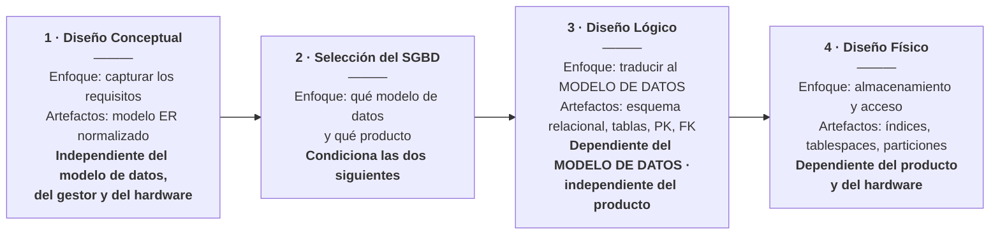

# Diseño de base de datos — conceptual, relacional y físico

> **Qué es este archivo.** El conceptual: por qué el diseño de una base de
> datos son **cuatro etapas** y no una, qué lleva cada una, cómo se pasa de una
> a la siguiente **con reglas y no con inspiración**, y cómo se comprueba que
> el resultado es correcto.
>
> Es el hueco más grande que tenía esta metodología: había un modelo
> entidad-relación completo, un modelo relacional normalizado y un script
> físico de miles de líneas, **y ningún documento que explicara cómo se llega a
> eso**.

---

## 1. Cuatro etapas, y lo que decide cada una es **de qué depende**

No son formatos del mismo dibujo: cada etapa **mira los mismos datos desde un
sitio distinto**, y —esto es lo que de verdad las separa— **depende de cosas
distintas**.

### La distinción que lo decide: **modelo de datos** no es **motor**

Son dos cosas, y confundirlas es el error más común de esta tabla —**yo lo
cometí dos veces al escribirla**—:

| | Qué es | Ejemplos |
|---|---|---|
| **Modelo de datos** | La **clase** de estructura con la que se va a representar | relacional · documental · grafo · clave-valor |
| **Motor o producto** | El programa concreto | MariaDB · Oracle · PostgreSQL · MongoDB |

**El diseño lógico depende del primero, NO del segundo.** Y el libro lo dice
con esas palabras:

> *«…basada en un **modelo de datos específico** pero **independiente de los
> detalles de nivel físico**. El diseño lógico requiere que todos los objetos
> del modelo conceptual se mapeen a los constructos específicos del **modelo de
> base de datos seleccionado**.»*
>
> — Coronel, Morris y Rob, 9.ª ed., **§9.6**

> **Ojo con una imprecisión del propio libro.** En §9.3 dice, de pasada, que el
> diseño lógico son «los datos **tal como los ve el gestor**». Esa frase suelta
> sugiere dependencia del producto, y **no es lo que define la sección 9.6**.
> Cuando las dos formulaciones de un libro no coinciden, manda **la
> definición**, no la frase de introducción.

### Y la prueba está en este proyecto, contada

Si el diseño lógico dependiera del motor, el modelo de datos de este proyecto
estaría lleno de MariaDB. Se cuenta:

| Dónde | Menciones de `citext`, `jsonb`, `GENERATED ALWAYS`, `EXCLUDE USING gist` |
|---|---|
| **`5_data_model.md`** — el lógico | **2** |
| **`db/init.sql`** — el físico | **241** |

**El modelo lógico de este sistema se podría llevar a PostgreSQL casi tal
cual**: las diez tablas, sus llaves, sus relaciones y sus restricciones son las
mismas. Lo que cambiaría son los tipos y los mecanismos — y todo eso vive en el
físico, que es donde le corresponde.

> **La regla práctica que sale de aquí:** si su modelo lógico no se puede
> llevar a otro producto **del mismo modelo de datos** sin rehacerlo, es que se
> le coló diseño físico dentro. **Eso es un olor, no una característica.**

### Qué se hace en cada etapa

| Etapa | Pasos |
|---|---|
| **1 · Conceptual** | Análisis y necesidades de datos · modelado y normalización entidad-relación · **verificación del modelo** |
| **2 · Selección del SGBD** | Estudiar ventajas y limitaciones · **y advertírselas al usuario** para no crear falsas expectativas |
| **3 · Lógico** | Mapear el conceptual a componentes lógicos · validar **con normalización** · validar **restricciones de integridad** · **validar contra las necesidades del usuario** |
| **4 · Físico** | Definir la estructura de almacenamiento · definir **integridad y seguridad** · definir las **formas de operación** |

### Y dos cosas más que se suelen decir mal

**1 · La selección del SGBD va ENTRE el conceptual y el lógico**, no después.
El libro la numera así —§9.4 conceptual, **§9.5 selección**, §9.6 lógico, §9.7
físico—. Saltarse esa etapa es decidir por omisión.

**2 · El lógico no es un documento interno del equipo.** Su cuarto paso es
**validar el modelo lógico contra las necesidades del usuario**. No termina en
el equipo: **termina volviendo donde quien pidió el sistema**.

> **Y ninguna de las cuatro se recorre en fila.** El libro lo dice: como casi
> todo el modelado de datos, **son iterativas**. Volver atrás no es un fracaso
> del método: es el método.

### La prueba de que el conceptual está bien hecho

Se lo puede leer en voz alta a quien conoce el negocio y **entiende cada
frase**. Si hay que explicarle qué es una clave foránea, el modelo se metió en
el nivel equivocado.

> **Tres correcciones declaradas, y las tres las encontró el lector, no yo.**
>
> 1. Dije que el modelo relacional *«se discute con el equipo»* y *«no habla
>    del motor concreto»*. **Las dos falsas.**
> 2. Puse la **selección del SGBD entre el lógico y el físico**. Va **antes**
>    del lógico.
> 3. Dije que el diseño lógico **depende del SGBD**. Depende del **modelo de
>    datos**; del producto, no.
>
> Quedan escritas en vez de borradas, y la tercera es la que más vale: **es la
> confusión que hace que un modelo lógico nazca atado a un producto** sin que
> nadie lo decida.

---

## 2. El modelo conceptual: entidad-relación, como lo definió Chen

Peter Chen lo publicó en **1976**, en el primer número de *ACM TODS*. Conviene
leer el artículo original, no un resumen: casi todos los resúmenes se saltan la
mitad.

### Las piezas

| Pieza | Qué es | Cómo se dibuja |
|---|---|---|
| **Entidad** | Una cosa de la que el negocio quiere guardar datos | Rectángulo |
| **Atributo** | Un dato de esa cosa | Elipse |
| **Relación** | Un hecho que liga dos o más entidades | **Rombo** |

> **El rombo es lo que distingue a Chen**, y es lo que casi todas las
> herramientas modernas eliminaron. Y con él se perdió algo: **una relación
> puede tener atributos propios**. En una notación sin rombo no hay dónde
> ponerlos, y el modelador los mete a la fuerza en una de las dos entidades —
> donde no pertenecen.

### Los tipos de atributo, que sí importan

| Tipo | Qué quiere decir | Qué pasa al pasar al relacional |
|---|---|---|
| **Simple** | Un valor | Una columna |
| **Compuesto** | Se descompone en partes | O varias columnas, o una sola: **hay que decidirlo** |
| **Multivaluado** | Varios valores a la vez | **Una tabla aparte, siempre** |
| **Derivado** | Se calcula de otros | **No se guarda**… salvo que se decida guardarlo, y entonces se dice por qué |

> **El multivaluado es el que más se equivoca**, y el error tiene nombre:
> `telefono1`, `telefono2`, `telefono3`. El día que alguien tenga cuatro, hay
> que cambiar el esquema. Un atributo multivaluado **es** una tabla, y decirlo
> en el conceptual evita la discusión después.

### Cardinalidad, opcionalidad y participación — que son tres cosas

Se confunden todo el tiempo:

| | Pregunta | Ejemplo |
|---|---|---|
| **Cardinalidad** | ¿Cuántos de un lado por cada uno del otro? | 1:1 · 1:N · **N:M** |
| **Opcionalidad** | ¿Puede no haber ninguno? | Una empresa **puede** no tener clientes todavía |
| **Participación** | ¿*Todos* los de este lado participan? | **Todo** renglón pertenece a una factura |

> **La participación total es la que se olvida**, y es la que produce datos
> huérfanos. «Todo renglón pertenece a una factura» no es cardinalidad: es que
> **no existe un renglón sin factura** — y por eso `fknumfactura` es `NOT NULL`.

### La entidad débil

Una entidad que **no se identifica sola**: su identificador incluye el de otra.

> *«La reunión 3» no significa nada suelta. Es la reunión 3 **de un evento**.*

No es un tecnicismo: es una afirmación sobre el negocio, y si es cierta hay que
modelarla — o el sistema permitirá crear una sesión que no es de nada.

---

## 3. La transformación conceptual → relacional: reglas, no criterio

Esta es la parte que más se improvisa y menos debería. Es **mecánica**: dos
personas que la apliquen bien obtienen lo mismo.

| # | Regla | Resultado |
|---|---|---|
| 1 | Cada **entidad** | una tabla |
| 2 | Cada **atributo simple** | una columna |
| 3 | Cada **atributo multivaluado** | **una tabla propia**, con la llave de la entidad |
| 4 | Cada **relación 1:N** | la llave foránea va **en el lado «muchos»** |
| 5 | Cada **relación N:M** | **una tabla propia** |
| 6 | Los **atributos de una relación** | van **en esa** tabla, no en las entidades |
| 7 | Cada **entidad débil** | su llave **incluye** la de la entidad fuerte |
| 8 | Cada **relación 1:1** | se decide dónde va la llave, y **se escribe por qué** |
| 9 | Cada **jerarquía supertipo/subtipo** | **se decide** entre una tabla, una por subtipo, o una por cada nivel |
| 10 | Cada **relación de grado 3 o más** | una tabla propia; y antes, **comprobar si de verdad es ternaria** |

> **Las reglas 9 y 10 son las que más se olvidan**, y las dos aparecen
> explícitamente en el orden de mapeo del libro: entidades fuertes →
> **supertipo/subtipo** → entidades débiles → relaciones binarias →
> **relaciones de grado superior**.
>
> Y sobre la 10 hay un consejo que vale: *para simplificar el diseño
> conceptual, siempre que se pueda, **la mayoría de las relaciones de orden
> superior se descomponen** en binarias*. Una relación ternaria de verdad es
> rara; casi todas son dos binarias mal vistas.

> **La regla 6 es la que justifica el rombo de Chen.** Si el precio acordado
> depende de *esta* venta y de *este* producto —y no del producto en general—,
> es un atributo **de la relación**, y va en la tabla puente. Ponerlo en el
> producto es el error más común del modelado, y no falla: da mal el día que
> alguien cambia el precio.

### Y las que no son reglas: las decisiones

Tres cosas **no** salen de la transformación y hay que decidirlas, cada una con
su razón escrita:

1. **Llave natural o sustituta.** Si el negocio ya tiene un identificador
   único, ¿se usa, o se pone uno propio? Cada opción tiene su costo.
2. **Qué se guarda derivado.** Un derivado normalmente no se guarda. Se guarda
   cuando **congelarlo es el requisito**: el `subtotal` de un renglón se
   guarda porque es el precio que el producto tenía **cuando se emitió la
   factura**, no el de hoy. Si se recalculara, subir un precio reescribiría las
   ventas del año pasado.
3. **Borrado físico o lógico.** Y si es lógico, qué pasa con la unicidad: un
   código retirado **¿libera su valor único o no?**

---

## 4. Normalización: qué anomalía evita cada forma

No es un ritual. Cada forma normal **evita una anomalía concreta**, y conviene
aprenderlas por la anomalía y no por la definición.

| Forma | Regla | Anomalía que evita |
|---|---|---|
| **1FN** | Ningún campo guarda dos cosas | Que haya que partir texto para consultar |
| **2FN** | Ningún campo depende de **parte** de la llave | Repetir el mismo dato en muchas filas, y que se contradigan |
| **3FN** | Ningún campo depende de otro que **no es** la llave | Actualizar en un sitio y que quede mal en otro |
| **BCNF** | Todo determinante es llave candidata | Los casos raros con dos llaves candidatas que se solapan |

### Las tres anomalías, dichas en concreto

| Anomalía | Qué pasa |
|---|---|
| **De inserción** | No se puede registrar un hecho **porque falta otro**: no se puede crear un programa hasta que haya un estudiante matriculado |
| **De actualización** | El mismo dato está en cien filas; se cambia en noventa y nueve |
| **De borrado** | Se borra una fila y **se pierde un hecho no relacionado**: se va el último matriculado y desaparece el programa |

### Cómo se hace de verdad: **midiendo**, no postulando

Esta es la parte que los cursos se saltan. Las dependencias funcionales **no se
suponen: se comprueban contra los datos**.

> **El ejemplo de este proyecto, y es de libro.** El maestro que se descarga
> del sistema institucional tiene tres columnas —documento, identificador y
> programa— y **más de dieciséis mil filas**. Al comprobar las dependencias
> contra esas filas, y no de memoria:
>
> | Dependencia | ¿Se cumple? | Evidencia medida |
> |---|---|---|
> | `documento → identificador` | **Sí** | Ningún documento con más de un identificador |
> | `identificador → documento` | **NO** | **Unos setecientos** identificadores con más de un documento |
>
> **Esa asimetría es el corazón del problema**, y nadie la habría adivinado: de
> un renglón se llega a su factura, pero de una factura **no** se llega a *un*
> renglón. De ahí sale que `productosporfactura` sea una tabla aparte, y no
> unas columnas en `factura`.
>
> **La lección para la metodología:** contar es una técnica de diseño. Un
> `GROUP BY … HAVING COUNT(*) > 1` sobre los datos reales destapa en un minuto
> lo que una reunión no destapa en una hora.

### Y cuándo NO normalizar

Se dice con la misma claridad, o queda como dogma:

- Cuando el dato **tiene que quedar congelado** —el histórico—. Eso no es
  desnormalizar: es que el hecho es otro.
- Cuando una consulta crítica se vuelve impracticable, **medido**, no supuesto.
- Y nunca «por rendimiento» sin el número al lado.

---

## 5. El modelo físico: donde el modelo se encuentra con el motor

Aquí aparecen cosas que en los dos niveles anteriores no existían.

### Lo que hay que decidir

| Decisión | Por qué importa |
|---|---|
| **Tipos y longitudes** | Una fecha es una fecha, **no un texto con forma de fecha** |
| **Restricciones** | `CHECK`, `UNIQUE`, `NOT NULL`: las reglas que el esquema puede defender solo |
| **Índices** | Lo que se consulta, no lo que se supone que se va a consultar |
| **Funciones y disparadores** | Las reglas que **no caben** en una restricción |
| **Vistas** | Consultas que se repiten, y que esconden una regla |
| **Comentarios** | `COMMENT ON` — la documentación que **viaja con el esquema** y no se queda atrás |

> **Los comentarios en el esquema son de lo más rentable que existe**, y casi
> nadie los pone. Un `COMMENT ON TABLE` explicando *por qué* esa tabla existe
> sobrevive a todos los documentos, porque está donde nadie lo puede perder de
> vista.

### Función no es lo mismo que procedimiento

Es una confusión común y vale la pena aclararla: en MariaDB, desde la
versión 11, **función y procedimiento son objetos distintos**. El
procedimiento puede manejar transacciones —abrir y cerrar—; la función no.
Llamar «procedimientos almacenados» a un conjunto de funciones es enseñar mal
una diferencia que sí importa.

### Las tres cosas que se pasan por alto al bajar al físico, con ejemplo

1. **El texto con forma de fecha.** Una columna `date` **no acepta** un
   parámetro de texto, aunque el texto se lea como fecha. Se descubre al correr
   el primer `INSERT` desde código, no antes.
2. **El booleano ausente.** `NULL` en un booleano **no es** `false`: es «no se
   sabe». Y una actualización parcial que no envía el campo no es lo mismo que
   una que lo envía en `false`.
3. **El retiro lógico y la unicidad.** Si se retira una ficha marcándola
   inactiva, **su código sigue ocupado**. Si eso no es lo deseado, la
   restricción única tiene que ser **parcial**.

---

## 6. Cómo se comprueba que el diseño es correcto

Cuatro comprobaciones, y las cuatro se pueden ejecutar:

1. **Trazabilidad hacia arriba.** Toda tabla del físico sale de una entidad o
   de una relación del conceptual. **Si una tabla no sale de ninguna, o sobra
   la tabla o falta en el conceptual.**
2. **Trazabilidad hacia abajo.** Toda entidad del conceptual llegó al físico, o
   está declarada fuera de alcance.
3. **Cobertura de reglas.** Toda regla de negocio que el esquema debe defender
   tiene su restricción, su disparador o su procedimiento.
4. **Se reconstruye desde cero.** El script corre en una base vacía y deja el
   sistema funcionando. **Un esquema que solo existe en el servidor de alguien
   no es un diseño: es un accidente.**

---

## 7. En el camino del prompt, el modelo de datos pesa más de lo que parece

Y esto tiene evidencia reciente, que conviene conocer antes de pedirle un
esquema a una IA:

- **Los modelos de lenguaje son sensibles al diseño del esquema.** Sobre
  esquemas **lógicamente equivalentes** poblados con los mismos datos, el SQL
  generado y las respuestas finales **difieren de forma sustancial**. La
  normalización, cómo se mapea la herencia y cómo se codifican las relaciones
  **cambian el resultado**.
- **Hay un estudio sistemático del efecto de la normalización** sobre ocho
  modelos, en datos sintéticos y reales.
- Y sobre el modelado conceptual —no el SQL— la literatura de 2026 documenta
  **limitaciones** claras: describir un MER no es lo mismo que construir uno
  correcto.

**La consecuencia práctica:** el modelo de datos **no es un insumo más** para
el prompt. Es el que más condiciona lo que la IA produce después — y por eso
va escrito y decidido **antes**, no generado de paso.

---

## 8. En este proyecto

**El documento del dominio es
[`../dominio/DISENO_BD.md`](spec_kit/versiones/0_mapa_versiones.md)**: las cuatro etapas de
este proyecto, con lo que se decidió y lo que se descartó en cada una.

| Nivel | Dónde está |
|---|---|
| **Conceptual** | [`DISENO_BD.md`](spec_kit/versiones/0_mapa_versiones.md) §1 — las siete familias de entidades y las tres decisiones que no son obvias |
| **Selección del motor** | [`DISENO_BD.md`](spec_kit/versiones/0_mapa_versiones.md) §2 — relacional y MariaDB 17, con lo descartado y **el costo declarado** |
| **Relacional** | [`DISENO_BD.md`](spec_kit/versiones/0_mapa_versiones.md) §3 — la transformación, las dependencias medidas y **la única desnormalización**, que es de `RN-22` |
| **Físico** | [`db/init.sql`](../../db/bdfacturas_postgres.sql): **37 tablas · 52 claves foráneas · 47 `CHECK` · 23 `UNIQUE` · 35 índices · 16 funciones · 7 disparadores · 6 vistas · 73 comentarios** — medido, no estimado |
| **Reglas** | [`../dominio/REGLAS_DE_NEGOCIO.md`](spec_kit/versiones/0_mapa_versiones.md) — las 38, con dónde se defiende cada una |
| **Datos** | [`../dominio/DATOS_DE_PRUEBA.md`](spec_kit/versiones/0_mapa_versiones.md) — 97 filas con su procedencia |

> **Y hay que decir algo incómodo sobre este proyecto:** aquí el diseño de base
> de datos **vino dado**. No se elicitó ni se construyó en este repositorio: se
> recibió ya hecho. Este documento explica **cómo se produce** para que la
> metodología sirva cuando no venga dado — que es el caso normal.

---

## 9. Referencias

### Fundacionales — los artículos, no los libros que los resumen

1. **Chen, P. P.-S.** (1976). «The Entity-Relationship Model — Toward a Unified
   View of Data». *ACM Transactions on Database Systems* **1**(1), pp. 9-36.
   DOI **`10.1145/320434.320440`**
   — **El artículo original**, y el que introduce el rombo y la técnica
   diagramática. Se cita este, no un resumen.
2. **Codd, E. F.** (1970). «A Relational Model of Data for Large Shared Data
   Banks». *Communications of the ACM* **13**(6), pp. 377-387.
   DOI **`10.1145/362384.362685`** — el origen del modelo relacional y de la
   normalización.
3. **Härder, T.; Reuter, A.** (1983). «Principles of Transaction-Oriented
   Database Recovery». *ACM Computing Surveys* **15**(4), pp. 287-317.
   DOI **`10.1145/289.291`** — donde se acuñó **ACID**. La **C** es «la base de datos de
   datos no acepta quedar mal», y por eso §5 importa.

### Actualizadas (2025-2026) — el modelo de datos frente a los LLM

4. «Exploring Database Normalization Effects on SQL Generation». **CIKM 2025**.
   DOI **`10.1145/3746252.3761583`** · arXiv **`2510.01989`**
   — **el primer estudio sistemático** del efecto de la normalización, sobre
   **ocho modelos**, en datos sintéticos y reales.
5. «Same Data, Different Schemas: Robustness of LLM-based Text-to-SQL».
   arXiv **`2605.25838`**, 2026 — sobre esquemas **lógicamente equivalentes**,
   el SQL generado y las respuestas **difieren sustancialmente**. Es el
   respaldo de §7.
6. «On the Limitations of Large Language Models for Conceptual Database
   Modeling». arXiv **`2605.11986`**, 2026 — las limitaciones al **modelar**,
   que son otras que al generar SQL.
7. «Exploring Large Language Models' Ability to Describe Entity-Relationship
   Schema-Based Conceptual Data Models». *Information* **16**(5), 368, 2025.
   DOI **`10.3390/info16050368`**.
8. «SchemaAgent: A Multi-Agents Framework for Generating Relational Database
   Schema». arXiv **`2503.23886`** — seis roles y corrección de errores
   acumulados. Útil para ver **cuánta estructura** hace falta para que salga
   bien.

### Textos de referencia — los que integran el ciclo completo

12. **Coronel, C.; Morris, S.; Rob, P.** — *Database Systems: Design,
    Implementation and Management*, **9.ª edición**, Cengage Learning, 2011.
    — **La fuente de la sección 1 de este documento.** Es el que formula los
    niveles como «los datos vistos por»: el usuario final, el gestor, el
    almacenamiento. Y el que deja claro que son **cuatro** etapas, con la
    selección del gestor entre el lógico y el físico.
13. **Elmasri, R.; Navathe, S. B.** — *Fundamentals of Database Systems*,
    7.ª ed., Pearson, 2015.
14. **Silberschatz, A.; Korth, H. F.; Sudarshan, S.** — *Database System
    Concepts*, 7.ª ed., McGraw-Hill, 2019.
15. **Date, C. J.** — *An Introduction to Database Systems*, 8.ª ed.,
    Addison-Wesley, 2003.

### Normas y documentación

9. **ISO/IEC/IEEE 15289:2019** — el modelo de datos es una **descripción**; el
   script físico, una especificación.
10. **IEEE Computer Society** (2024). ***SWEBOK Guide v4.0***, área
    *Software Design*.
11. **MariaDB** — documentación oficial de restricciones, disparadores,
    funciones y procedimientos.

> **Comprobadas en línea el 14 de septiembre de 2026.** Las que llevan DOI se
> abren por el DOI; las de arXiv, por su identificador.
