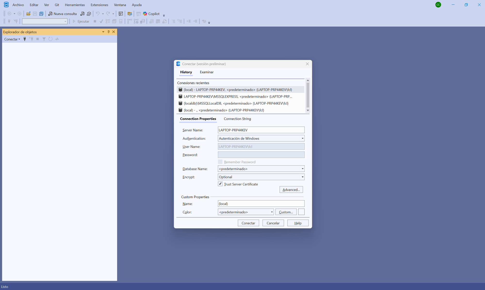
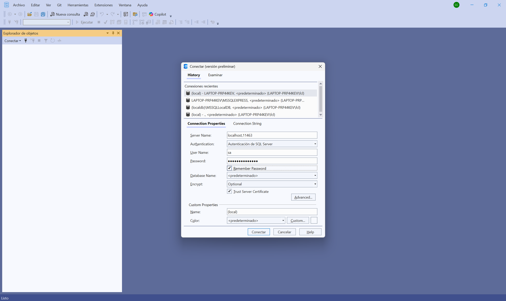
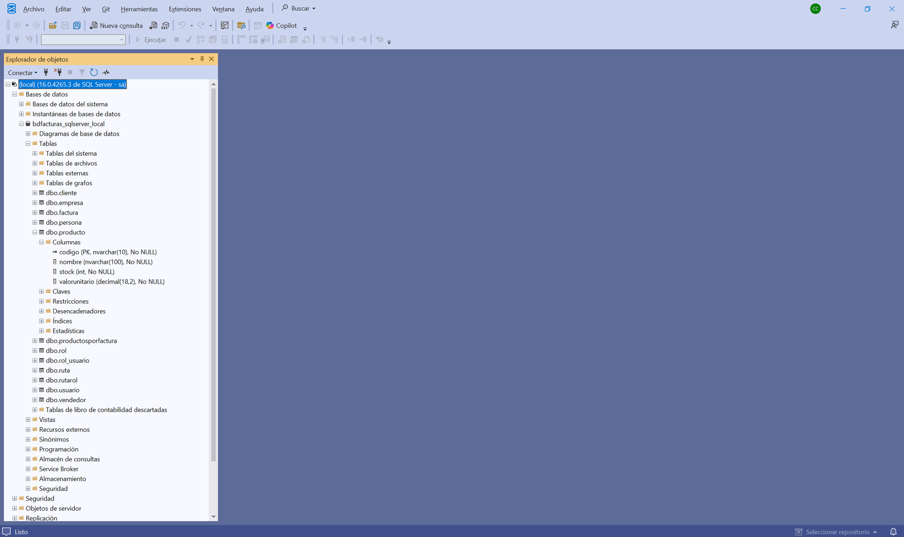
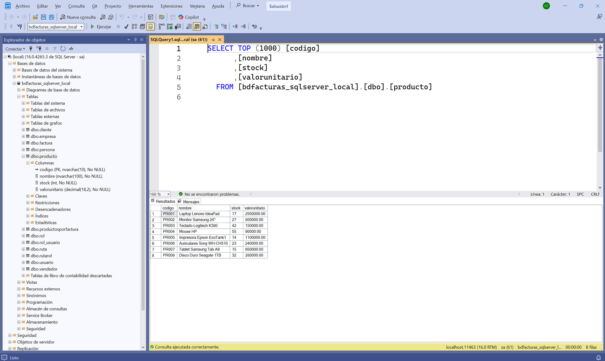
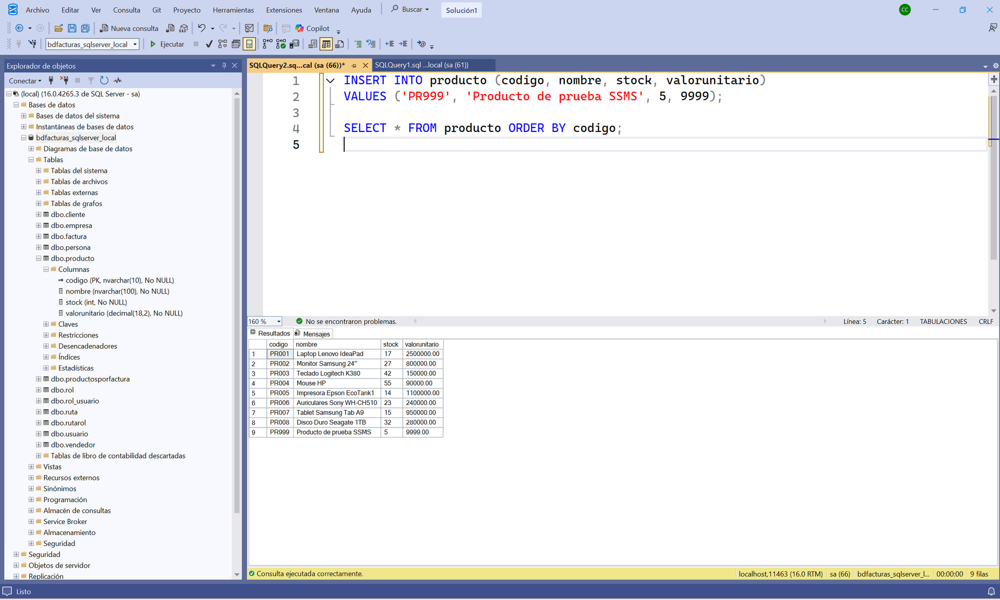
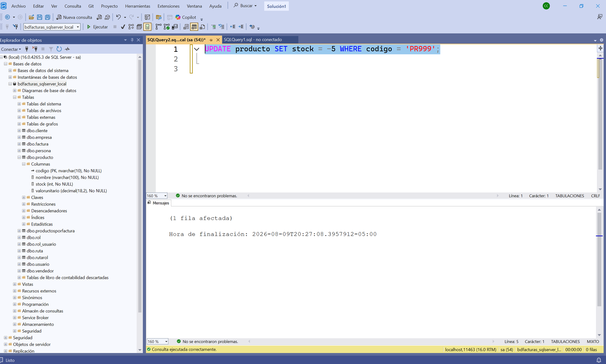
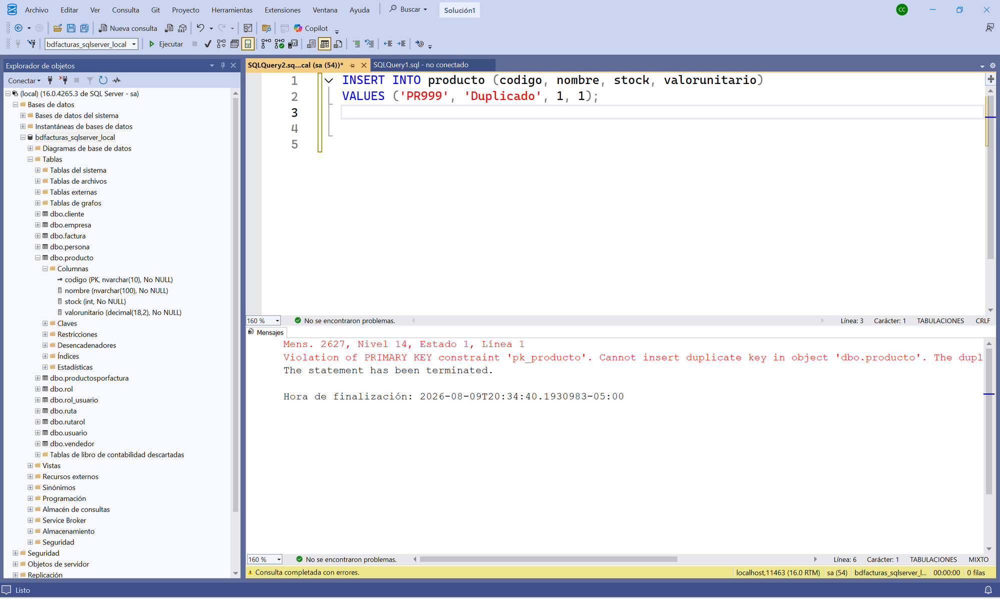
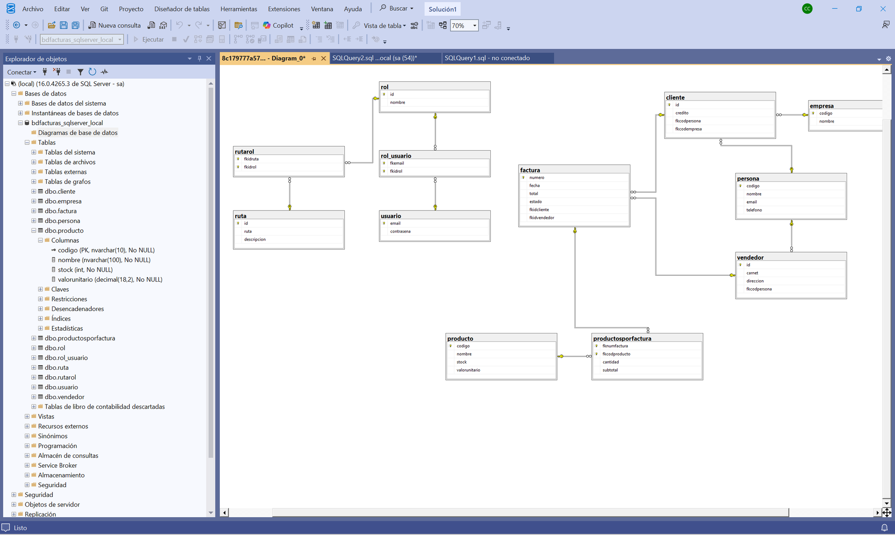

# Tutorial — Administrar la base de datos con PostgreSQL Management Studio (SSMS)

> Tutorial paso a paso para explorar y administrar **bdfacturas_postgres_local**
> (la BD del proyecto) usando **PostgreSQL Management Studio (SSMS)**, el
> administrador oficial de PostgreSQL.
>
> Prerrequisito: el proyecto corriendo (`docker compose up -d --build` en la
> raíz del repositorio, ver [README](../README.md)).

---

## Paso 1 — Instalar y abrir SSMS

SSMS es una aplicación de escritorio gratuita de Microsoft (no viene con
Visual Studio: se instala aparte). Descárguela de la página oficial:

**https://aka.ms/ssms**

Instalación siguiente-siguiente; no pide configurar nada. Al abrirla,
SSMS muestra de una vez el diálogo **Conectar** (en las versiones
recientes tiene el aspecto de la captura; en versiones anteriores la
ventana se llama *Connect to Server* — los campos son los mismos):



Para leer en esta pantalla:

- La pestaña **History** lista las conexiones recientes: con el uso, la
  del proyecto quedará ahí para reconectar con un clic.
- **Connection Properties** es donde se llena todo lo del paso 2:
  *Server Name*, *Authentication* y el check **Trust Server Certificate**.
- Detrás quedó la ventana principal con el **Explorador de objetos**
  vacío — se llena al conectar.

---

## Paso 2 — Conectarse al PostgreSQL del proyecto

El motor PostgreSQL corre dentro del contenedor `postgres` y está
**publicado** en el puerto **15435** de su PC. En el diálogo **Conectar**
(pestaña *Connection Properties*) llene así:

| Campo | Valor |
|---|---|
| **Server Name** | `localhost,15435` |
| Authentication | `Autenticación de PostgreSQL` (*PostgreSQL Authentication*) |
| User Name | `sa` |
| Password | `Paradigmas123!` |
| Trust Server Certificate | ✅ **marcado** |

Así debe quedar el diálogo antes de conectar:



Para leer en esta pantalla:

- **Remember Password** marcado evita reescribir la clave en cada sesión
  (razonable en SU máquina de estudio; jamás en un equipo compartido).
- **Database Name** puede quedar en `<predeterminado>`: la BD se escoge
  después, desde el Explorador de objetos.
- En **Custom Properties → Name** puede bautizar la conexión (ej.:
  `curso-postgres`) para reconocerla en el History del paso 1.

Dos detalles que causan el 90 % de los fallos de conexión:

- El puerto va con **COMA**, no con dos puntos: `localhost,15435`. Es la
  sintaxis propia de PostgreSQL (a diferencia de las URL, que usan `:`).
- **Trust server certificate** debe quedar marcado. Las versiones nuevas
  de SSMS exigen conexión cifrada por defecto, y el contenedor usa un
  certificado autofirmado: sin ese check aparece el error *"The
  certificate chain was not issued by an authority that is trusted"*.

Clic en **Conectar**: el **Explorador de objetos** (panel izquierdo) se
llena con el servidor conectado.

---

## Paso 3 — Explorar la base de datos y sus objetos

En el Explorador de objetos expanda: **Bases de datos →
`bdfacturas_postgres_local` → Tablas**, y dentro de **`dbo.producto`**
expanda **Columnas**:



Para leer en esta pantalla:

- El nodo raíz informa la versión del motor y con quién está conectado:
  `(local) (16.0.xxxx de PostgreSQL - sa)`.
- **Tablas** — las **12 tablas** de bdfacturas, con el prefijo `dbo.`
  (el esquema por defecto de PostgreSQL): cliente, empresa, factura,
  persona, producto, productosporfactura, vendedor y el módulo de
  seguridad (rol, rol_usuario, ruta, rutarol, usuario). Todo esto lo
  creó `db/bdfacturas_postgres.sql` la primera vez que subió el proyecto.
- **Columnas** de producto: `codigo (PK, nvarchar(10), No NULL)` — la
  llavecita = llave primaria —, `nombre (nvarchar(100))`, `stock (int)`
  y `valorunitario (decimal(18,2))`. Compare con el modelo `Producto`
  de la API: los mismos tipos vistos desde el motor (es la tabla del
  [modelo de datos](spec_kit/versiones/0_mapa_versiones.md)).
- **Claves / Restricciones / Desencadenadores** — la llave primaria y
  los **triggers** de facturación ("desencadenadores" en español), ya
  escritos y esperando a las versiones siguientes del curso. En el paso
  5 se verá con precisión QUÉ reglas hace cumplir esta BD (y cuáles no).
- Más abajo, **Programación → Procedimientos almacenados** guarda los
  SP de facturación (misma historia: infraestructura dada desde la v1).
- Las carpetas *Tablas del sistema*, *Vistas*, *Service Broker*, etc.
  son partes estándar del motor — no las creó el curso.

> 💡 La regla de la v1 sigue vigente aquí: la BD completa se VE, pero el
> código de la versión solo toca la tabla `producto`.

---

## Paso 4 — Ver y editar datos

Clic derecho sobre **`dbo.producto`** → **Seleccionar las 1000 filas
superiores** (*Select Top 1000 Rows*). SSMS escribe la consulta por
usted, la ejecuta y muestra los resultados:



Para leer en esta pantalla:

- **La consulta generada** (arriba) es SQL normal, con los manierismos
  de PostgreSQL: `TOP (1000)` en vez de `LIMIT`, corchetes `[...]` en
  los nombres, y el nombre completo de la tabla en tres partes:
  `[bdfacturas_postgres_local].[dbo].[producto]` (BD → esquema → tabla).
- **Resultados** (abajo): los **8 productos de fábrica** (PR001–PR008)
  que sembró `db/bdfacturas_postgres.sql`. Compare con
  `http://localhost:8005/api/producto`: es la MISMA información — una
  vista por SQL y otra por la API.
- **La barra de estado** (abajo a la derecha) resume la sesión completa:
  servidor `localhost,15435`, usuario `sa`, la BD y **8 filas**.

También existe **Editar las 200 filas superiores** (*Edit Top 200
Rows*): abre la tabla en modo edición, como una hoja de cálculo. Cambie
el stock de un producto, refresque el GET de la API y véalo cambiado.

> ⚠️ *Editar filas* escribe DIRECTO en la BD, sin pasar por la API ni
> por sus validaciones. Es útil para administrar, pero en el flujo
> normal del curso los datos entran por la API (que es quien valida).

---

## Paso 5 — Ejecutar sus propias consultas

Botón **Nueva consulta** (`Ctrl+N`). Verifique en el **combo de la
barra de herramientas** que está parado sobre `bdfacturas_postgres_local`
(ese combo decide DÓNDE se ejecuta lo que escriba — equivale al `USE` de
SQL) y ejecute con **F5** (o el botón *Ejecutar*):

```sql
INSERT INTO producto (codigo, nombre, stock, valorunitario)
VALUES ('PR999', 'Producto de prueba SSMS', 5, 9999);

SELECT * FROM producto ORDER BY codigo;
```



Para leer en esta pantalla:

- El SELECT ahora trae **9 filas** (lo confirma la barra de estado):
  los 8 de fábrica más su `PR999` al final.
- Véalo también por la otra puerta: `http://localhost:8005/api/producto`
  muestra el mismo PR999 — SSMS y la API le hablan a la MISMA base de
  datos.
- Un batch puede llevar varias sentencias: el INSERT y el SELECT se
  ejecutaron juntos, en orden.

Ahora intente algo que DEBERÍA estar prohibido — un stock negativo:

```sql
UPDATE producto SET stock = -5 WHERE codigo = 'PR999';
```



**"(1 fila afectada)" — ¡la BD lo ACEPTÓ!** Y esa es la lección más
importante de este paso:

- La tabla `producto` solo tiene restricciones **estructurales**: la
  llave primaria, los tipos y los `NOT NULL`. **No hay CHECK de
  rangos** (véalo usted mismo en `db/bdfacturas_postgres.sql`).
- ¿Quién prohíbe entonces el stock negativo? **La API**: la petición
  del verbo declara `[Range(0, …)]`, así que por la puerta de la API un
  stock `-5` muere en **422** sin tocar la BD (pruébelo: el mismo
  cambio vía PATCH es rechazado).
- Por SQL directo usted entra POR DETRÁS de esa muralla. Por eso en el
  flujo del curso los datos entran por la API — y por eso ser `sa`
  exige respeto.

La regla que la BD SÍ hace cumplir aquí es la **llave primaria** —
pruebe a insertar un código repetido:

```sql
INSERT INTO producto (codigo, nombre, stock, valorunitario)
VALUES ('PR999', 'Duplicado', 1, 1);
```



Para leer en esta pantalla:

- **Mens. 2627**: *Violation of PRIMARY KEY constraint `pk_producto`.
  Cannot insert duplicate key* — la BD rechazó el duplicado y **"The
  statement has been terminated"**: la fila NO entró (la barra de abajo
  lo confirma: 0 filas).
- `pk_producto` es el nombre que `db/bdfacturas_postgres.sql` le dio a la llave
  primaria — el mismo que vio en el árbol del paso 3.
- Compare las dos caras del paso: el stock negativo ENTRÓ (no hay regla
  en la BD); el código repetido NO (la PK sí es regla de la BD). Saber
  QUIÉN hace cumplir CADA regla — la BD o la API — es entender la
  arquitectura.

Y al final repare y limpie la prueba:

```sql
DELETE FROM producto WHERE codigo = 'PR999';
```

---

## Paso 6 — El diagrama de tablas y relaciones

En el Explorador de objetos, dentro de la BD: clic derecho en
**Diagramas de base de datos → Nuevo diagrama de base de datos**. (La
primera vez SSMS pregunta si crea los objetos de soporte de diagramas —
responda **Sí**.) En el cuadro **Agregar tabla** agregue las 12 tablas,
cierre el cuadro y acomode las cajas:



Para leer en el diagrama:

- Cada caja es una tabla; la **llavecita dorada** marca su llave
  primaria.
- Cada línea es una **llave foránea**: la llavecita va del lado "uno" y
  el símbolo ∞ del lado "muchos". Ahí está la historia del negocio:
  **persona** ← cliente y vendedor ← **factura** ←
  **productosporfactura** → **producto**, y aparte el módulo de
  seguridad: **usuario** ↔ rol (vía rol_usuario) ↔ ruta (vía rutarol).
- `productosporfactura` es la tabla puente de la relación
  muchos-a-muchos entre factura y producto — la esquina donde la v2 del
  curso va a trabajar.
- Ese dibujo ES el [modelo de datos de la
  v1](spec_kit/versiones/0_mapa_versiones.md),
  dibujado por el motor real.

Si guarda el diagrama (`Ctrl+S`, póngale un nombre), queda dentro de la
propia BD, bajo *Diagramas de base de datos*.

---

## Paso 7 — Backup y restore desde SSMS

SSMS también respalda con clic derecho: **Tasks → Back Up…** y **Tasks →
Restore → Database…**. Pero ojo con un detalle propio de este proyecto:

> ⚠️ SSMS corre en SU PC, pero el motor corre DENTRO del contenedor: las
> rutas que muestran esos diálogos (`/var/opt/mssql/data/...`) son del
> **contenedor**, no de su disco. El `.bak` queda adentro y luego hay
> que copiarlo con `docker compose cp`.

Por eso el método estándar del curso es el de
[backupdb/README.md](../backupdb/README.md) (dos comandos: backup dentro
del contenedor + copia a la carpeta `backupdb/`). Use los diálogos de
SSMS cuando administre un PostgreSQL instalado directo en la máquina;
aquí, prefiera los comandos del README.

---

## Precauciones finales

- `sa` es el **superusuario**: puede borrar cualquier tabla o la BD
  entera. Con poder viene responsabilidad.
- Para volver la BD a su estado inicial de fábrica no necesita backup:
  `docker compose down -v` y volver a subir (el `-v` borra el volumen de
  datos y el inicializador recrea todo desde `db/bdfacturas_postgres.sql`).
- Las tablas distintas de `producto` son infraestructura de las
  versiones siguientes: mírelas todo lo que quiera, pero no las
  modifique.
