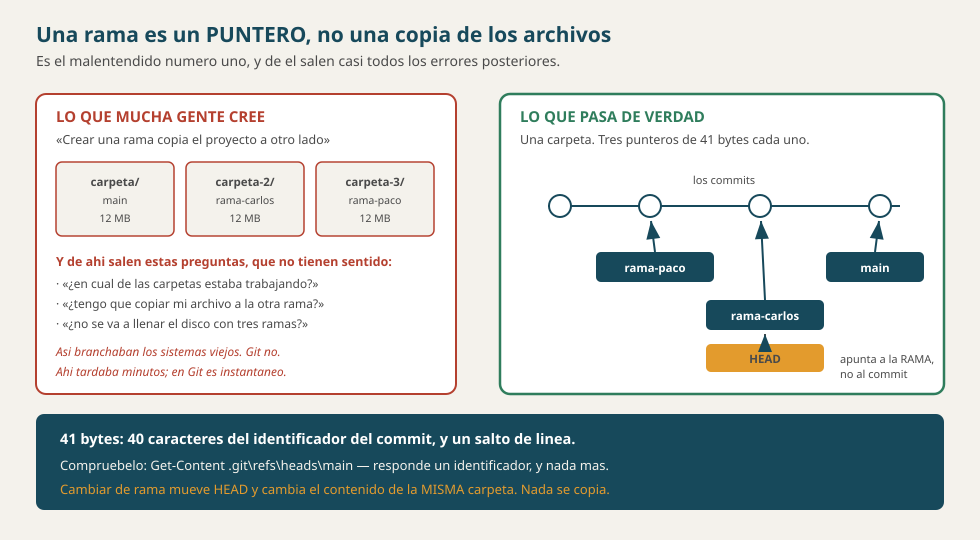
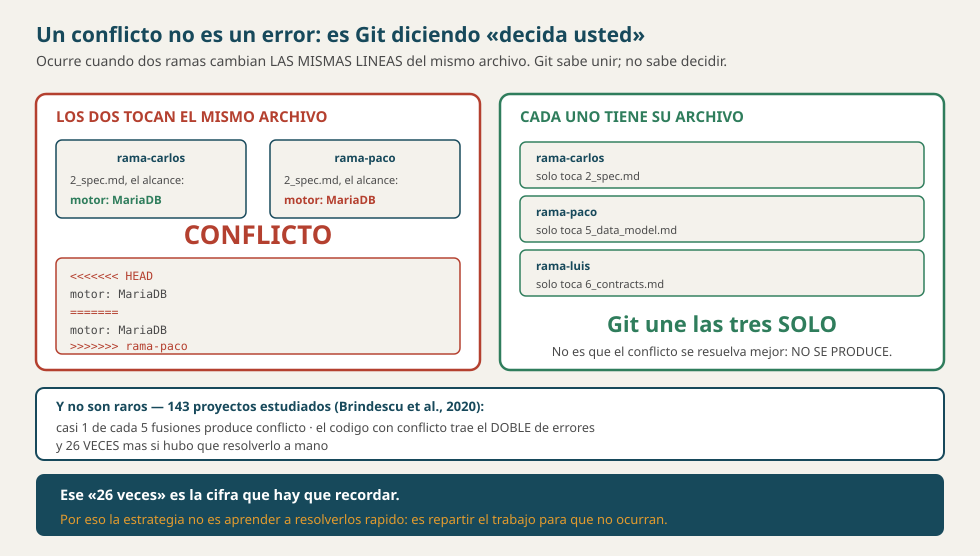
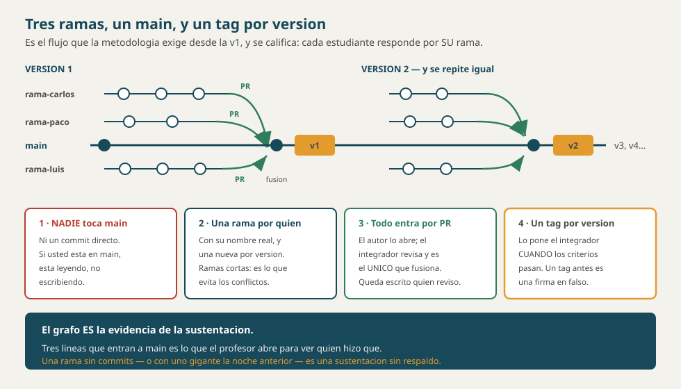

# Ramas y colaboración en Git — qué son y cómo se trabajan

**Documento conceptual del curso**

> **Qué es este documento.** Qué es una rama, qué pasa de verdad cuando se crea
> una, por qué se fusiona, por qué se produce un conflicto y **cómo trabaja un
> equipo de tres sin pisarse**. Con los comandos explicados: qué hace cada uno,
> para qué, y qué efecto tiene.
>
> **Qué NO es.** No es la norma. **La norma es
> [`1_constitution.md`](../spec_kit/1_constitution.md) §4.1**, que
> es obligatoria desde la v1 y se califica. Esto explica **por qué** esa norma
> dice lo que dice.
>
> **Y este repositorio SÍ practica lo que el documento enseña**, lo cual no
> siempre fue cierto: tiene 15 ramas, 15 fusiones `--no-ff` y tres
> contribuyentes. Cómo llegó a estarlo —y qué costó— está en §16.

---

## 1. El problema que resuelve una rama

Tres personas, un proyecto, un `main`. Sin ramas, esto es lo que pasa:

| Sin ramas | Qué se rompe |
|---|---|
| Los tres escriben sobre `main` | El código a medias de uno **rompe** la prueba del otro |
| Hay que esperar turno para subir | El que llega segundo se queda bloqueado |
| Nadie puede experimentar | Probar algo que puede no funcionar **es tocar lo que ya funcionaba** |
| Y al calificar: todo es de todos | **Nadie puede responder por su propio trabajo** |

> **Una rama es una línea de trabajo propia que no estorba a nadie.** Y de esa
> definición sale la regla de oro del aula, que no es capricho: **`main` es lo
> que funciona**, y lo que todavía no se sabe si funciona vive en otra parte.

---

## 2. Qué es una rama DE VERDAD: un puntero, no una copia

**Éste es el malentendido número uno**, y de él salen casi todos los errores que
vienen después. Mucha gente cree que crear una rama **copia los archivos** a otro
lado. No.

> *«A branch in Git is simply a lightweight movable pointer to one of these
> commits.»*
> — **Pro Git**, Chacon y Straub, §3.1

Y el libro da la cifra exacta de lo que cuesta:

> *«Because a branch in Git is actually a simple file that contains the 40
> character SHA-1 checksum of the commit it points to, branches are cheap to
> create and destroy. Creating a new branch is as quick and simple as writing 41
> bytes to a file (40 characters and a newline).»*

**41 bytes.** Eso es una rama: un archivo con el identificador de un commit.



### Compruébelo en este repositorio

```powershell
# QUÉ HACE: muestra el contenido del archivo que ES la rama main.
# PARA QUÉ: para ver con los ojos que una rama es un identificador, no una carpeta.
# EFECTO: ninguno. Solo lee.
Get-Content .git\refs\heads\main
```

Responde **un identificador de 40 caracteres** y nada más. Ahí no hay archivos de
su proyecto: hay la dirección de un commit.

### Y entonces, ¿quién sabe en qué rama estoy?

Un segundo puntero, que se llama **`HEAD`**:

```powershell
# QUÉ HACE: dice a qué rama apunta HEAD, es decir, en qué rama está usted parado.
# PARA QUÉ: antes de hacer un commit, para no dejarlo en la rama equivocada.
# EFECTO: ninguno.
git branch --show-current
```

| Puntero | A qué apunta |
|---|---|
| Una **rama** (`main`, `rama-carlos`) | a un **commit** |
| **`HEAD`** | a una **rama** |

> **Cambiar de rama es mover `HEAD`** y poner en sus archivos lo que esa rama
> apunta. No se copia nada a otra carpeta: **la carpeta es la misma y el
> contenido cambia**. Por eso cambiar de rama con trabajo sin guardar es un
> problema — y por eso Git se niega.

---

## 3. El historial es un grafo, no una lista

Cada commit guarda **quién es su padre**. Un commit normal tiene **uno**; un
commit de fusión tiene **dos**. Eso convierte el historial en un grafo.

```powershell
# QUÉ HACE: dibuja el historial como grafo, una línea por commit.
# PARA QUÉ: es la única forma de VER las ramas y las fusiones.
# EFECTO: ninguno. Se sale con la tecla q.
git log --oneline --graph --all --decorate
```

> **Si usted no puede dibujar el grafo, no sabe en qué estado está su
> repositorio** — y entonces cualquier comando que mueva ramas es una apuesta.
> Este comando es el que hay que correr **antes** de fusionar, no después.

---

## 4. Las cuatro operaciones, y sus comandos

```powershell
# 1 · CREAR una rama y pasarse a ella, en un solo paso.
# QUÉ HACE: crea un puntero nuevo donde usted está, y mueve HEAD ahí.
# PARA QUÉ: empezar a trabajar sin tocar main.
# EFECTO: sus archivos NO cambian — la rama nueva apunta al mismo commit.
git switch -c rama-carlos

# 2 · CAMBIAR a una rama que ya existe.
# EFECTO: sus archivos pasan a ser los de esa rama. Si tiene cambios sin
#         guardar que estorben, Git se niega — y hace bien.
git switch main

# 3 · VER las ramas. El asterisco marca dónde está usted.
#     Con -a, también las que están en GitHub.
git branch -a

# 4 · BORRAR una rama ya fusionada.
# EFECTO: borra el puntero, NO los commits. Con -d Git se niega si no está
#         fusionada; con -D obliga, y ahí sí se pueden perder commits.
git branch -d rama-carlos
```

### `git switch` o `git checkout`? La pregunta está mal planteada

**Para cambiar de rama son idénticos.** No hay matiz, no hay diferencia de
comportamiento:

```
$ git checkout rama-paco
Switched to branch 'rama-paco'

$ git switch main
Switched to branch 'main'
```

Y lo mismo con `git switch -c nueva` y `git checkout -b nueva`.

**El problema no es lo que `checkout` hace de más: es que lo hace con la misma
palabra.**

| `git checkout X` | Si `X` es… | Entonces |
|---|---|---|
| | una **rama** | se cambia a ella — inofensivo |
| | un **archivo** | **lo restaura y descarta sus cambios** — irreversible |

> **Y eso no es una advertencia teórica.** Con un archivo editado y sin guardar,
> el mismo nombre con los dos comandos:
>
> ```
> $ cat 2_spec.md
> El motor es MariaDB.      ← media hora de trabajo sin guardar
>
> $ git switch 2_spec.md
> fatal: invalid reference: 2_spec.md        ← se NIEGA. No pasa nada.
>
> $ git checkout 2_spec.md
> Updated 1 path from the index              ← y ya está hecho
>
> $ cat 2_spec.md
> El motor es PostgreSQL.      ← el trabajo ya no existe
> ```
>
> **Sin aviso, sin confirmación y sin papelera.** `checkout` no preguntó porque,
> desde su punto de vista, usted le pidió exactamente eso.

**Por eso Git se partió en dos en la versión 2.23 (2019):**

| | Para qué |
|---|---|
| **`git switch`** | solo **ramas** |
| **`git restore`** | solo **archivos** |

> **Lo que se gana no es comodidad: es que el error deja de ser posible.** Con
> `switch`, equivocarse de nombre da un mensaje de error. Con `checkout`,
> equivocarse de nombre puede costar la tarde — y el caso peor es cuando una
> rama y un archivo se llaman parecido, porque entonces **el comando funciona**,
> solo que no hace lo que usted creía.
>
> **En el curso se usa `switch`.** `checkout` se menciona porque es lo que sale
> en todos los tutoriales viejos y hay que saber leerlo — no porque esté mal.

---

## 5. Fusionar: *fast-forward* contra commit de fusión

Fusionar es traer el trabajo de una rama a otra. Hay **dos** formas, y Git elige
sola:

| | Cuándo ocurre | Qué deja en el historial |
|---|---|---|
| ***Fast-forward*** | `main` **no avanzó** desde que usted ramificó | **Nada**: solo adelanta el puntero. La rama desaparece del grafo |
| **Commit de fusión** | `main` **sí avanzó** | Un commit con **dos padres**, y las dos líneas se ven en el grafo |

```powershell
# QUÉ HACE: trae a la rama donde usted ESTÁ el trabajo de la rama que nombra.
# PARA QUÉ: integrar. Ojo con el orden: primero hay que PARARSE en el destino.
# EFECTO: cambia los archivos de la rama actual.
git switch main
git merge rama-carlos
```

### Y por qué en el aula conviene forzar el commit de fusión

```powershell
# --no-ff: "no fast-forward". Obliga a dejar un commit de fusión aunque no
#          hiciera falta.
# PARA QUÉ: para que en el grafo quede constancia de que ESA rama existió y
#           de QUÉ traía.
git merge --no-ff rama-carlos
```

> **Esto no es estética: es la evidencia de la sustentación.** La rúbrica dice
> que *«cada estudiante responde por SU rama»*. Si todas las fusiones son
> *fast-forward*, el grafo queda **plano** y ya no se distingue dónde empezaba y
> terminaba el aporte de cada quien.
>
> Con `--no-ff`, `git log --graph` muestra tres líneas que entran a `main` — y eso
> es lo que el profesor abre.

---

## 6. Conflictos: por qué ocurren y qué tan comunes son

Un conflicto **no es un error**: es Git diciendo *«dos ramas cambiaron las
mismas líneas y yo no puedo decidir cuál vale»*.

**Y no son raros.** El estudio más citado sobre esto analizó **143 proyectos**
de código abierto:

| El dato | De dónde sale |
|---|---|
| **Casi 1 de cada 5 fusiones** produce conflicto | Brindescu *et al.*, 2020 |
| En **75.23 %** de los casos hubo que **entender la lógica** del programa para resolverlo | ídem |
| El código de una fusión con conflicto tiene **el doble** de probabilidad de traer un error | ídem |
| Si hizo falta **intervención manual**: **26 veces** más probable | ídem |

> **Ese «26 veces» es la cifra que hay que recordar.** Resolver un conflicto a
> mano no es un trámite: es el momento **más peligroso** de todo el trabajo con
> ramas. Por eso la estrategia de este curso no es *«aprender a resolverlos
> rápido»*, es **que no ocurran** (§7).



### Qué se ve cuando hay uno

Git **escribe en el archivo** unas marcas:

```
<<<<<<< HEAD
El motor de la base de datos es MariaDB.      ← lo que hay donde USTED está
=======
El motor de la base de datos es MariaDB.   ← lo que trae la rama que entra
>>>>>>> rama-carlos
```

### Cómo se resuelve, en cuatro pasos

```powershell
# 1 · Ver CUÁLES archivos quedaron en conflicto.
#     Aparecen bajo «Unmerged paths».
git status

# 2 · Abrir cada uno y dejar el archivo COMO DEBE QUEDAR.
#     No es escoger un lado: a veces la respuesta correcta es una mezcla.
#     Hay que borrar las tres líneas de marcas: <<<<<<<, ======= y >>>>>>>.

# 3 · Decirle a Git que ese archivo ya está resuelto.
git add docs/spec_kit/versiones/v1_sin_fk/2_spec.md

# 4 · Cerrar la fusión. Git propone un mensaje; se deja.
git commit
```

> **El paso 2 es el único que importa, y es el que no se puede automatizar.** Las
> marcas se quitan a mano porque **la decisión es del programador**: hay que
> saber qué hacía cada versión. Ese 75.23 % de arriba es exactamente esto.

> **Y una salida que conviene conocer:** si se dio cuenta de que la fusión estaba
> mal planteada, **se puede abortar**.
> ```powershell
> # EFECTO: deshace la fusión y lo devuelve al estado de antes. No pierde su trabajo.
> git merge --abort
> ```

---

## 7. La prevención estructural: que el conflicto no pueda ocurrir

Las dos causas, según una encuesta a **109 desarrolladores** (Costa *et al.*,
2021), son:

| Causa | Y cómo se evita |
|---|---|
| **El tiempo que una rama está aislada** | Ramas **cortas**: se fusionan a los días, no a las semanas |
| **Falta de comunicación** | Repartir **por archivos** y decirlo en voz alta |

Y el programa de investigación **DORA** —el estudio más grande de rendimiento de
entrega de software— encontró que lo que distingue a los equipos de élite es
justamente eso: **menos de tres ramas activas** y ramas que viven **menos de un
día** antes de integrarse.

### De ahí sale el reparto por archivos, que es lo que el curso usa

| | Lo suyo | Y entonces |
|---|---|---|
| **Carlos** | `docs/spec_kit/.../2_spec.md` | nadie más lo toca |
| **Paco** | `docs/spec_kit/.../5_data_model.md` | nadie más lo toca |
| **Luis** | `docs/spec_kit/.../6_contracts.md` | nadie más lo toca |

> **El reparto vale igual para los documentos que para el código**, y empieza
> antes: el spec kit se escribe **antes** de programar, así que es lo primero
> que los tres van a tocar a la vez. Si los tres editan `2_spec.md`, el conflicto
> llega el primer día — antes de haber escrito una línea de código.

> **Si los tres editaran el mismo archivo, cada fusión sería un conflicto.**
> Repartir por archivos hace que **Git una las ramas solo**. No es que los
> conflictos se resuelvan mejor: es que no se producen.

### Y el truco de los archivos vacíos (*stubs*)

El integrador crea **desde el primer día** los tres archivos con los métodos
**vacíos**, y el `main`/`Program` que los llama.

> **Por qué esto vale tanto.** Así el punto de entrada queda **completo el primer
> día** y **nadie más necesita tocarlo nunca** — y el punto de entrada es
> justamente el archivo que todos tendrían que modificar, es decir, **el único
> conflicto garantizado del proyecto**.
>
> Cuesta una hora el primer día y ahorra un conflicto por ronda.

---

## 8. La identidad: lo más importante de este documento

**Antes del primer commit**, cada estudiante configura quién es, **dentro de su
carpeta del proyecto**:

```powershell
# QUÉ HACE: guarda su nombre y su correo para los commits de ESTA carpeta.
# PARA QUÉ: para que el trabajo se le acredite a USTED.
# EFECTO: escribe dos líneas en .git\config. No toca el código.
# OJO: SIN --global, a propósito. Ver abajo.
git config user.name "su-usuario-de-github"
git config user.email "su-correo-de-github"
```

```powershell
# COMPROBARLO antes de hacer commits. Si responde vacío o el nombre de otro,
# pare y arréglelo ahora.
git config user.name
git config user.email
```

**Por qué es lo más importante:**

| | |
|---|---|
| Git guarda ese nombre y ese correo **dentro de cada commit, para siempre** | Es lo que convierte el trabajo en **aporte suyo** |
| GitHub enlaza el commit con una cuenta **por el correo** | Si el correo no coincide con el de su cuenta, el commit **no aparece** en *Insights → Contributors* |
| **Si se olvida, no se arregla después** | sin reescribir **todo** el historial (§12) |
| **Sin `--global`** la configuración queda **dentro de esa carpeta** | Por eso tres carpetas pueden tener tres identidades en el mismo computador |

### ¿Cuál carpeta? Y si cada quien tiene su propio PC, ¿para qué?

**«La carpeta» es la del proyecto**, la que queda al hacer `git clone`. Git
guarda ahí un `.git/config`, y de ahí saca el nombre con el que firma.

**Y la pregunta justa es: si cada persona trabaja en su propio computador,
`--global` serviría igual.** Es cierto. No está mal usarlo. Lo que está mal es
**confiar en él sin mirarlo**, y por tres situaciones que ocurren de verdad:

| Situación | Qué pasa con `--global` |
|---|---|
| **El computador de la sala** | La configuración es la del que se sentó antes. Sus commits salen con el nombre de otro, **sin un solo aviso** |
| **Casa y universidad** | Son dos máquinas. Si solo configuró una, la mitad de sus commits están mal firmados |
| **Dos cuentas** — la personal y la del curso | La global las firma todas igual |

> **Lo que protege no es dónde esté la configuración: es comprobarla.** Dos
> líneas antes del primer commit de cada carpeta nueva, y ya. El `--global` es
> comodidad; la comprobación es el seguro.

### Firmar y subir son DOS cosas, y en un computador compartido fallan distinto

| | Qué decide | Dónde vive | Cuando se comparte el PC |
|---|---|---|---|
| **La identidad** | quién **firma** el commit | `.git/config`, o la global | el historial dice el nombre equivocado |
| **La credencial** | quién lo **sube** | el almacén de Windows, **una por servidor** | **el `push` se va con la cuenta del anterior** |

> **Y esto es lo que sorprende: arreglar una no arregla la otra.** Se puede tener
> un commit correctamente firmado por Paco y subido con la cuenta de Carlos — y
> GitHub lo va a mostrar como de Paco, porque **la autoría la da la firma**, no
> quien empujó.
>
> **El problema de la credencial es otro:** si el almacén tiene la de Carlos,
> Paco puede estar escribiendo en un repositorio donde **no debería poder**, o
> recibir un rechazo que no entiende. Se resuelve borrando la credencial
> guardada antes de cambiar de persona, o con `gh auth switch`.

> **La consecuencia práctica, dicha sin rodeos: un commit firmado con el correo
> equivocado es trabajo que usted hizo y que no se le va a contar.** Y la
> rúbrica evalúa «incluidos los commits». Dos líneas de configuración al
> principio, o una sustentación sin evidencia al final.

> **Y una advertencia sobre `--global`:** si varios estudiantes usan el mismo
> computador, `--global` hace que **todos firmen con el mismo nombre**. Es el
> error más común cuando se trabaja en la sala.

---

## 9. Sincronizar: `fetch`, `pull` y la diferencia que importa

```powershell
# QUÉ HACE: trae de GitHub lo que haya nuevo, SIN tocar sus archivos.
# PARA QUÉ: enterarse antes de decidir. Es el comando seguro.
# EFECTO: actualiza su copia de origin/main. Su rama NO se mueve.
git fetch origin

# QUÉ HACE: lo mismo, y ADEMÁS lo fusiona en la rama donde usted está.
# EFECTO: sus archivos cambian. Aquí es donde aparece un conflicto.
git pull origin main
```

> **`pull` es `fetch` + `merge` en un solo paso.** Y el problema de hacerlo en un
> paso es que usted **no vio** qué venía antes de fusionarlo. Cuando algo huele
> raro, `fetch` primero, mire el grafo, y después decida.

### Y el `--rebase`, que conviene entender antes de usarlo

```powershell
# QUÉ HACE: en vez de crear un commit de fusión, REESCRIBE sus commits para
#           que queden ENCIMA de lo que traía el remoto.
# EFECTO: historial más limpio. Y sus commits cambian de identificador.
git pull --rebase origin main
```

| | Deja | Cuándo sirve |
|---|---|---|
| `pull` (merge) | un commit de fusión, el grafo con dos líneas | siempre seguro |
| `pull --rebase` | una línea recta, más fácil de leer | **solo en SU rama**, que nadie más usa |

> **Con una regla que no se negocia, y es de Pro Git §3.6:**
>
> *«Do not rebase commits that exist outside your repository and that people may
> have based work on.»*
>
> Traducido a este curso: **rebase sobre su rama, nunca sobre `main`.** Si
> reescribe commits que su compañero ya tenía, el repositorio de su compañero
> queda inservible.

---

## 10. Las dos estrategias de integración

| | **Merge directo** (terminal) | **Pull Request** (GitHub) |
|---|---|---|
| Cómo entra a `main` | el integrador fusiona desde su terminal | el autor **abre un PR** y el integrador lo revisa y lo aprueba |
| Quién revisa antes | **nadie** | el integrador, con el `diff` en pantalla |
| Deja constancia de la revisión | no | **sí**, con comentarios y quién aprobó |
| Sirve cuando | el equipo está en la misma sala y se habla | el equipo se coordina poco, o hay que **demostrar** que alguien revisó |

> **El aula exige Pull Request** — §4.1 de la metodología: *«Todo llega a `main`
> por Pull Request: el autor abre el PR desde su rama, el encargado del main lo
> revisa (¿compila? ¿cumple la spec? ¿los criterios siguen pasando?) y SOLO el
> encargado hace el merge.»*
>
> **Y la razón es de evidencia, no de ceremonia:** un PR deja escrito **quién
> revisó qué y cuándo**. En un merge desde la terminal, eso no queda en ninguna
> parte — y lo que no queda escrito no se puede calificar.

---

## 11. Tags: cómo se cierra una versión

Una rama **se mueve**; un tag **no**. Un tag es un nombre clavado a un commit.

```powershell
# QUÉ HACE: pone el nombre v1 al commit donde usted está, con un mensaje.
# PARA QUÉ: marcar «aquí la versión 1 pasó sus criterios de aceptación».
# EFECTO: crea una referencia que ya no se mueve.
git tag -a v1 -m "Version 1: los seis recursos sin clave foranea"

# Los tags NO viajan con un push normal. Hay que mandarlos.
git push origin v1
```

**En este repositorio los tags son reales y se usan:**

```powershell
git tag          # responde: v1 v2 v3 v4
```

> **Y sirven para algo concreto, no de adorno.** Con dos tags se puede medir qué
> cambió entre dos versiones — y eso es lo que prueba que las capas están bien
> hechas:
>
> ```powershell
> # Lo que el cambio de motor tocó ARRIBA. Sale VACÍO.
> git diff --stat v4..v5 -- api_facturas/Controllers api_facturas/Servicios
> ```
>
> Sin tags, esa prueba no se puede escribir. Ver
> **`ARQUITECTURA.md`** §3.

> **El aula pide un tag `vN` por versión, puesto por el integrador** cuando los
> criterios pasan. No antes: un tag sobre código que no cumple es una firma en
> falso.

---

## 12. Reescribir el historial — y cómo se borra todo

Git **puede** cambiar el pasado. Y por eso hay que saber exactamente qué cuesta.

| Comando | Qué reescribe | Peligro |
|---|---|---|
| `git commit --amend` | **el último** commit | bajo, si no se ha subido |
| `git rebase -i` | varios commits: juntarlos, renombrarlos, reordenarlos | medio |
| `git reset --hard` | **mueve la rama atrás y borra su trabajo sin guardar** | **alto** |
| `git push --force` | **el historial del remoto** | **el más alto de todos** |

> **La regla que resume todas:** reescribir lo que **solo está en su computador**
> es gratis. Reescribir lo que **ya está en GitHub** rompe el repositorio de
> todos los que lo clonaron.

### El secreto que se sube una vez se queda para siempre

```powershell
# Esto NO borra la contraseña: la borra del archivo de HOY, y la deja en el
# commit de AYER, que sigue ahí.
git rm --cached .env ; git commit -m "quitar .env"
```

> **Un secreto que entró al historial hay que considerarlo quemado**, aunque el
> archivo ya no esté: cualquiera que clone el repositorio puede sacarlo de un
> commit viejo. Lo único que de verdad lo arregla es **cambiar la contraseña**.
> De ahí el `.gitignore` **desde el primer commit**.

### Y entonces: ¿se puede borrar todo y empezar de nuevo?

**Sí.** Técnicamente es fácil:

```powershell
# A · Rama huérfana: conserva los archivos de hoy y deja UN solo commit.
# EFECTO: el historial anterior queda inalcanzable; el remoto se sobreescribe.
git checkout --orphan limpio
git add -A
git commit -m "Primer commit"
git branch -D main
git branch -m main
git push --force origin main
```

**Pero antes hay que contar qué se pierde**, y en este repositorio está medido:

| Se pierde | Y eso significa |
|---|---|
| **Los commits** y las fechas | **`CRONOGRAMA.md`** está construido **entero** de `git log`: queda falso de arriba a abajo |
| **Los tags `v1`–`v4`** | la prueba `git diff v4..v5` de §11 **ya no se puede recrear**: los commits que nombra no existirían |
| **La atribución** | quién hizo qué, y cuándo. En un trabajo en equipo, eso **es la nota** |
| El historial del remoto | quien ya clonó queda roto: su `git pull` falla |

> **De ahí la regla para el proyecto de aula: el historial no se borra.** No por
> purismo, sino porque **ahí vive la evidencia de quién trabajó**. Un repositorio
> con un commit único la noche anterior no es un repositorio limpio: es una
> sustentación sin respaldo.
>
> **Y si lo que molesta son los mensajes**, eso se arregla sin borrar nada:
> `git rebase -i` renombra mensajes **conservando los commits**.

---

## 13. Lo que no se hace

| No se hace | Por qué |
|---|---|
| **Commitear en `main`** | §4.1: *«NADIE trabaja en main. Nunca. Ni un commit directo»* |
| **Un commit gigante la noche anterior** | La rúbrica lo nombra: *«una rama con un solo commit gigante es una sustentación sin evidencia»* |
| `git add .` sin `.gitignore` | Arrastra `bin/`, `obj/`, `.env`, y el repositorio pesa diez veces más |
| `git push --force` a una rama compartida | Borra el trabajo de otros **en el remoto** |
| Una rama que vive tres semanas | Es la causa #1 de conflictos (Costa *et al.*) |
| `git commit -m "avances"` | No dice nada. El formato es `tipo: descripción` |

---

## 14. El laboratorio: todo lo anterior, corrido de verdad

> **Lo que sigue NO está escrito de memoria.** Es la salida real de cuatro
> repositorios desechables creados el **4 de octubre de 2026**. Los
> identificadores de commit son los que salieron; si usted repite los pasos,
> saldrán otros, y todo lo demás será igual.
>
> **Se puede repetir en diez minutos**, y conviene hacerlo: esto se entiende
> haciéndolo, no leyéndolo.

### 14.1 · Los 41 bytes, medidos

Carlos arranca un repositorio y escribe la especificación de la v1:

```
$ git init -q ; git branch -M main
$ git config user.name "carlos-github"
$ git config user.email "carlos@correo.com"
$ git add -A ; git commit -m "docs: la especificacion de la v1"

$ cat .git/refs/heads/main
0bb9f5fcc9eb402d69751f59651354d0c62025d0

$ wc -c < .git/refs/heads/main
41
```

**Cuarenta y un bytes.** Eso es la rama `main`: el identificador del commit, y
un salto de línea. Ni un archivo del proyecto está ahí.

### 14.2 · Crear una rama no copia nada

```
$ ls -la 2_spec.md
   antes:  2_spec.md  90 bytes

$ git switch -c rama-paco

$ ls -la 2_spec.md
   despues de crear la rama:  2_spec.md  90 bytes   ← el MISMO archivo

$ cat .git/refs/heads/rama-paco
0bb9f5fcc9eb402d69751f59651354d0c62025d0   ← el MISMO commit que main
```

> **Las dos ramas apuntan al mismo sitio y la carpeta no cambió.** Eso es todo lo
> que pasó al «crear una rama». Compárelo con lo que la mayoría cree (§2).

### 14.3 · Un conflicto de verdad, sobre un documento

Paco, en su rama, cambia el motor a MariaDB. Carlos, sin saberlo, cambia **la
misma línea** a MariaDB:

```
$ git log --oneline --graph --all --decorate
* 927bc44 (HEAD -> main) docs: el motor pasa a MariaDB
| * fad38ce (rama-paco) docs: el motor pasa a MariaDB
|/
* 0bb9f5f docs: la especificacion de la v1
```

> **Ahí se ve la bifurcación**: dos commits distintos colgando del mismo padre.
> Ese dibujo es la razón por la que §3 insiste en correr `--graph` **antes** de
> fusionar: el conflicto ya era visible.

```
$ git merge rama-paco
Auto-merging docs/2_spec.md
CONFLICT (content): Merge conflict in docs/2_spec.md
Automatic merge failed; fix conflicts and then commit the result.
   (codigo de salida: 1)

$ git status --short
UU docs/2_spec.md
```

Y el documento quedó así:

```
# Especificacion de la version 1

## Alcance

<<<<<<< HEAD
El motor de la base de datos es MariaDB.
=======
El motor de la base de datos es MariaDB.
>>>>>>> rama-paco
```

> **Mire lo que Git NO hizo: no escogió.** Y no podía: la pregunta *«¿en qué
> motor va este proyecto?»* no se responde comparando textos — **se responde
> decidiendo**. Por eso el paso 2 de §6 es el único que no se puede automatizar.
>
> **Y fíjese en que esto pasó sobre un `.md`, no sobre código.** Un conflicto no
> entiende de lenguajes: entiende de **líneas**. El spec kit da conflictos
> exactamente igual que un `.py` — y da antes, porque se escribe antes.

Carlos decide —MariaDB—, deja el archivo como debe quedar, borra las tres
marcas, y cierra:

```
$ git add docs/2_spec.md
$ git commit

$ git log --oneline --graph --decorate
*   0a7722e (HEAD -> main) Merge branch 'rama-paco'
|\
| * fad38ce (rama-paco) docs: el motor pasa a MariaDB
* | 927bc44 docs: el motor pasa a MariaDB
|/
* 0bb9f5f docs: la especificacion de la v1

$ git log -1 --format='%p'
927bc44 fad38ce        ← DOS padres. Eso es un commit de fusion.
```

### 14.4 · El mismo trabajo, repartido por documentos: cero conflictos

Ahora los tres, cada uno con **lo suyo**: Carlos el `2_spec`, Paco el
`5_data_model`, Luis el `6_contracts`. Los tres escriben a la vez, en sus ramas.

```
$ git merge --no-ff rama-paco -m "merge: rama-paco (modelo de datos)"
Merge made by the 'ort' strategy.
 1 file changed, 2 insertions(+)

$ git merge --no-ff rama-luis -m "merge: rama-luis (contrato)"
Merge made by the 'ort' strategy.
 1 file changed, 2 insertions(+)
```

**Cero conflictos. Nadie abrió un archivo a mano.** Y el grafo quedó contando
quién hizo qué:

```
$ git log --oneline --graph --decorate
*   d3f0974 (HEAD -> main) merge: rama-luis (contrato)
|\
| * 319e940 (rama-luis) docs: el contrato de la v1
* |   b77bc89 merge: rama-paco (modelo de datos)
|\ \
| * | 5bee775 (rama-paco) docs: el modelo de datos de la v1
| |/
* / 35ae2bd docs: el alcance de la v1
|/
* 7158419 chore: montaje, los tres documentos del spec kit vacios
```

> **Es el mismo trabajo y el mismo número de commits que en 14.3.** Lo único que
> cambió fue **quién toca qué archivo** — y con eso desapareció el conflicto.
> Ésa es la tesis de §7, y ahí está corrida.

### 14.5 · La atribución, que es la nota

```
$ git shortlog -sne --all
     4  carlos-github <carlos@correo.com>
     1  luis-github <luis@correo.com>
     1  paco-github <paco@correo.com>

$ git log -1 --format='%an' -- docs/2_spec.md          → carlos-github
$ git log -1 --format='%an' -- docs/5_data_model.md    → paco-github
$ git log -1 --format='%an' -- docs/6_contracts.md     → luis-github
```

> **Eso es lo que el profesor abre.** Y sale así porque cada uno corrió sus dos
> líneas de `git config` (§8). Si los tres hubieran trabajado con la
> configuración `--global` del computador de la sala, **las seis líneas dirían el
> mismo nombre** — y no habría forma de repartir la nota.
>
> Carlos aparece con 4 porque hizo el montaje y las dos fusiones: **el integrador
> siempre suma de más**, y eso no es trabajo de contenido. Por eso se mira
> también la segunda tabla, la de quién escribió cada documento.

### 14.6 · Por qué `--no-ff`, visto en los dos grafos

**Sin** `--no-ff`, cuando `main` no avanzó:

```
$ git merge rama-paco
Updating 95fe2ca..1de9f53

$ git log --oneline --graph --decorate
* 1de9f53 (HEAD -> main, rama-paco) docs: Paco escribe el modelo
* 95fe2ca base
```

> **La rama desapareció del grafo.** Queda una línea recta, y ya no se ve que ese
> trabajo vino de otra parte ni dónde empezaba.

**Con** `--no-ff`, el mismo caso:

```
$ git merge --no-ff rama-paco -m "merge: rama-paco"

$ git log --oneline --graph --decorate
*   4499a9b (HEAD -> main) merge: rama-paco
|\
| * 9acbc3a (rama-paco) docs: Paco escribe el modelo
|/
* ee781ad base
```

> **Ahora sí se ve dónde empezaba y dónde terminaba el aporte de Paco** — que es
> exactamente lo que la sustentación necesita mostrar.

---

## 15. La receta: un equipo de tres, paso a paso



### Ronda 0 — El montaje, una sola vez

**El integrador** (digamos Carlos):

```powershell
# 1 · Crear el repositorio PRIVADO en GitHub e invitar al profesor
#     (Settings → Collaborators → Add people → ccastro2050).
#     Sin acceso del profesor, la entrega no existe.

# 2 · En su carpeta local: arrancar el repositorio.
git init
git branch -M main

# 3 · SU IDENTIDAD. Antes del primer commit. Ver §8.
git config user.name "carlos-github"
git config user.email "carlos@correo.com"

# 4 · El .gitignore ANTES del primer commit. Ver §12.
#     Luego: los TRES documentos del spec kit, vacíos, uno por persona (§7).

# 5 · El primer commit y la conexión con GitHub.
git add -A
git commit -m "chore: montaje, con los tres documentos del spec kit vacios"
git remote add origin https://github.com/EQUIPO/REPO.git
git push -u origin main
```

**Cada compañero**, una sola vez:

```powershell
# 1 · Traer el proyecto a su computador.
git clone https://github.com/EQUIPO/REPO.git
cd REPO

# 2 · SU IDENTIDAD, dentro de ESTA carpeta (§8).
git config user.name "paco-github"
git config user.email "paco@correo.com"

# 3 · Comprobar que quedó bien. Si sale el nombre de Carlos, no siga.
git config user.name
```

### El ciclo de cada versión — lo que se repite

**Cada estudiante, en su turno:**

```powershell
# 1 · Pararse en main y traer lo último. Siempre, antes de ramificar.
git switch main
git pull origin main

# 2 · Crear SU rama para esta versión.
git switch -c rama-paco-v1

# 3 · Trabajar SOLO en su archivo (§7). Commits pequeños y frecuentes:
git add docs/spec_kit/versiones/v1_sin_fk/5_data_model.md
git commit -m "docs: el modelo de datos de la v1"
#    ... y otro, y otro. No uno solo al final.

# 4 · Comprobar que compila y corre ANTES de subir.

# 5 · Subir su rama. El -u solo hace falta la primera vez.
git push -u origin rama-paco-v1

# 6 · Abrir el Pull Request en GitHub: de su rama hacia main.
#     Describir QUÉ hizo y contra qué criterio del spec.
```

**El integrador, al cerrar la versión:**

```powershell
# 1 · Revisar cada PR: ¿compila? ¿cumple la spec? ¿los criterios pasan?
# 2 · Aprobar y fusionar los tres DESDE GITHUB. Solo él.
# 3 · Traer el main ya fusionado y comprobar que TODO corre junto.
git switch main
git pull origin main

# 4 · El tag de cierre, cuando los criterios pasan (§11).
git tag -a v1 -m "Version 1: criterios de aceptacion cumplidos"
git push origin v1
```

**Todos, para sincronizarse antes de la versión siguiente:**

```powershell
git switch main
git pull origin main
```

> **El orden importa y no es decorativo.** Ramificar siempre **desde un `main`
> recién traído** es lo que mantiene las ramas cortas — y las ramas cortas son
> lo que evita los conflictos (§7). Ramificar desde un `main` de hace dos
> semanas es fabricar el conflicto a mano.

---

## 16. En este proyecto

```powershell
git branch -a
#   main
#   rama-carlos-v1 … rama-carlos-v5
#   rama-paco-v1   … rama-paco-v5
#   rama-luis-v1   … rama-luis-v5
```

| | |
|---|---|
| Ramas | **15**, una por persona por versión |
| Fusiones | **15**, todas con `--no-ff` — y las 15 son del integrador |
| Contribuyentes | **tres** |
| Tags | `v1` a `v5` |

**Y hasta el 4 de octubre de 2026 este documento decía lo contrario**: que el
repositorio tenía **una sola rama**, 110 commits directos sobre `main` y cero
Pull Requests. Era cierto, y estaba escrito aquí de frente.

### Lo que costó cambiarlo, que es la lección

El historial viejo **no se pudo convertir**: hubo que **borrarlo y
reconstruirlo**. Y eso tuvo un precio que conviene conocer antes de intentarlo en
un proyecto propio:

| Lo que pasó | |
|---|---|
| **110 commits desaparecieron de GitHub** | Quedan en un respaldo `git bundle` verificado, fuera del repositorio |
| **Los tags cambiaron de commit** | `v1`–`v4` pasaron a apuntar a commits nuevos, y nació `v5` |
| **Tres documentos quedaron mintiendo** | `CRONOGRAMA` entero, y dos secciones de `SUSTENTACION` |
| **Una prueba dejó de correr** | `git diff v3..v4` ya no existía; hoy es `v4..v5` |

> **Y eso último es lo que hay que llevarse de aquí:** la prueba de §11 —la que
> demuestra que cambiar de motor no toca los controladores— **dependía de dos
> tags**. Reescribir el historial la rompió sin avisar, y siguió apareciendo en
> **tres documentos**, con su bloque de código, pareciendo cierta.
>
> **Un historial no es solo historia: es algo sobre lo que otras cosas se
> apoyan.** Por eso §12 insiste en no reescribir lo publicado — y por eso aquí se
> hizo **con un respaldo verificado antes de tocar nada**.

> **Lo que sí se conservó, y se comprobó:** los **361 archivos**, con el árbol
> final **idéntico** al de antes. El historial cambió; el sistema, no.

---

## 17. Cómo se relaciona con lo demás

| Documento | Qué aporta |
|---|---|
| [`1_constitution.md`](../spec_kit/1_constitution.md) §4.1 | **La norma.** Esto solo la explica |
| [`CONCEPTOS_PLAN_DE_DESARROLLO.md`](CONCEPTOS_PLAN_DE_DESARROLLO.md) | Las rondas y el calendario que las ramas ejecutan |
| [`SDD_SPECKIT.md`](SDD_SPECKIT.md) | Las tres compuertas: lo que el integrador revisa en el PR |
| **`CRONOGRAMA.md`** | Lo que se puede leer de un `git log` |
| **`ARQUITECTURA.md`** §3 | La prueba con tags de §11 |

---

## 18. Referencias

### Científicas actualizadas

1. **Brindescu, C., Ahmed, I., Jensen, C. y Sarma, A.** (2020).
   *An empirical investigation into merge conflicts and their effect on software
   quality*. **Empirical Software Engineering**, vol. 25, n.º 1, pp. 562–590.
   DOI **`10.1007/s10664-019-09735-4`** — 143 proyectos de código abierto. De
   aquí salen las cuatro cifras de §6: **casi 1 de cada 5** fusiones produce
   conflicto, en **75.23 %** de los casos hubo que entender la lógica del
   programa, el código de una fusión con conflicto tiene **el doble** de
   probabilidad de traer un error, y **26×** si hizo falta intervención manual.

2. **Costa, C., Menezes, J., Trindade, B. y Santos, R.** (2021). *Factors that
   Affect Merge Conflicts: A Software Developers' Perspective*. **SBES '21** —
   *Brazilian Symposium on Software Engineering*, Joinville, Brasil.
   DOI **`10.1145/3474624.3474641`** — encuesta a **109 desarrolladores**. Los
   dos factores principales que llevan a un conflicto son **el tiempo que una
   rama está aislada** y **la falta de comunicación**. Es el sustento de §7.

3. **Forsgren, N., Humble, J. y Kim, G.** (2018). ***Accelerate: The Science of
   Lean Software and DevOps***. IT Revolution Press. — El programa **DORA** y
   sus informes anuales *State of DevOps*: el **desarrollo sobre el tronco**
   (*trunk-based development*) predice el rendimiento de entrega, y se
   caracteriza por **menos de tres ramas activas** y ramas que viven **menos de
   un día**. Informes en `https://dora.dev/research/`.

> **Comprobadas en línea el 4 de octubre de 2026.** Las tres primeras se abren
> por su DOI.

### De gurús, blogs y fuentes primarias

1. **Chacon, S. y Straub, B.** ***Pro Git***, 2.ª edición, Apress. Libro
   **gratuito y oficial** del proyecto Git —
   `https://git-scm.com/book/en/v2`
   - **§3.1 «Branches in a Nutshell»** — de aquí sale la definición de §2: *«A
     branch in Git is simply a lightweight movable pointer to one of these
     commits»*, y los **41 bytes**.
   - **§3.6 «The Perils of Rebasing»** — la regla de oro citada en §9: *«Do not
     rebase commits that exist outside your repository and that people may have
     based work on»*.

2. **Driessen, V.** (enero de 2010). *A successful Git branching model* —
   `https://nvie.com/posts/a-successful-git-branching-model/`
   El modelo que se conoce como **git-flow**: `master`, `develop`, y ramas de
   *feature*, *release* y *hotfix*.
   > **Y hay que leer la nota que el propio autor le puso encima el 5 de marzo
   > de 2020**, diez años después: recomienda **no** usarlo si el equipo hace
   > entrega continua, y adoptar algo **más simple, como GitHub Flow**, en vez
   > de *«shoehorn git-flow into your team»*. Es el mejor ejemplo disponible de
   > que una buena práctica tiene **contexto**, y de que un autor honesto lo
   > dice cuando el contexto cambia.

3. **GitHub**. *GitHub Flow* — `https://docs.github.com/en/get-started/using-github/github-flow`
   El flujo simple: una rama por tarea, Pull Request, revisión, *merge*. **Es el
   modelo que el aula usa**, con un integrador fijo.

4. **Hammant, P.** *Trunk Based Development* — `https://trunkbaseddevelopment.com/`
   El sitio de referencia del desarrollo sobre el tronco, y el contrapeso
   explícito a git-flow.

5. **Documentación oficial de los comandos** — `https://git-scm.com/docs`
   En particular `git-switch`, `git-merge`, `git-rebase` y `git-push`, que es
   donde está escrito **con precisión** qué hace cada bandera de este documento.
