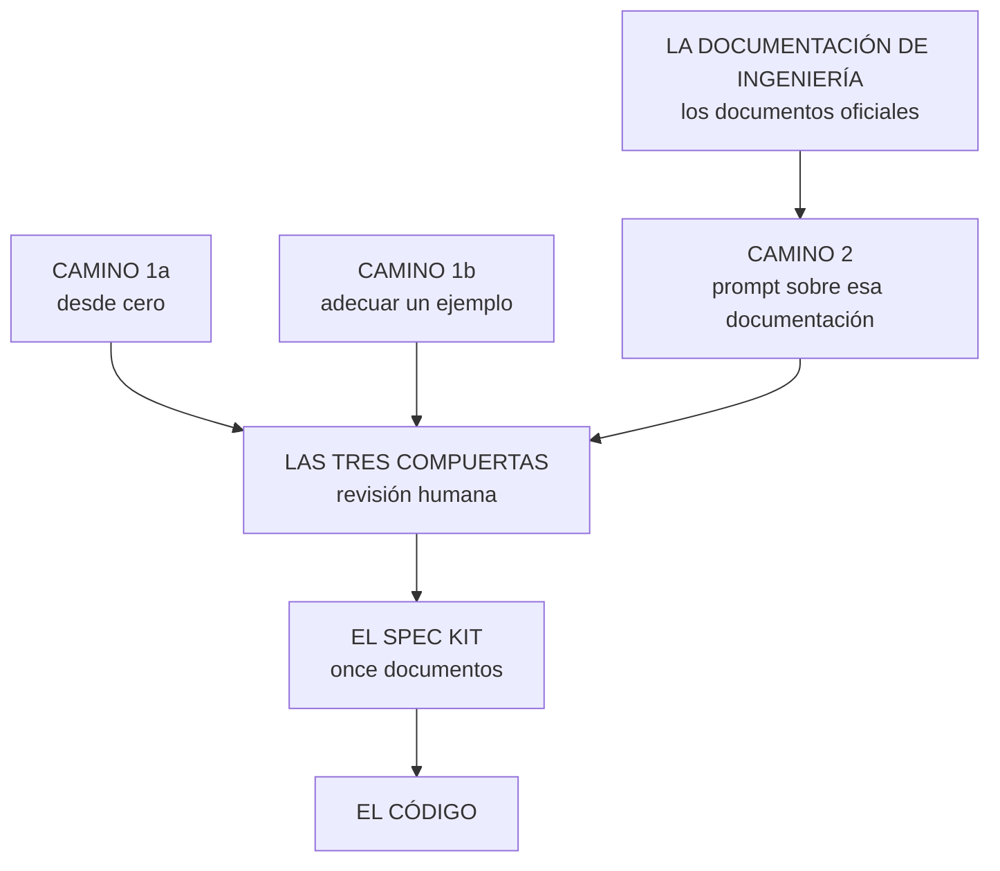

# Los documentos de la ingeniería del software — los que alimentan el spec kit

> **Lo primero, porque es lo que ordena todo lo demás:**
>
> ## La metodología termina en el spec kit.
>
> El spec kit es **el destino**. Lo demás son **caminos para llegar**, y hay
> tres:
>
> | | Cómo se llega | Cuándo conviene |
> |---|---|---|
> | **1a** | **Desde cero**: el ingeniero redacta los once documentos | Se está aprendiendo el método. Es lento y es el único que enseña |
> | **1b** | **Tomando un ejemplo y adecuándolo** | Ya hay un proyecto parecido hecho. Rápido, y el riesgo es arrastrar lo que no aplica |
> | **2** | **Documentación de ingeniería + prompt**: se escribe la base de datos y la IA redacta el kit | Hay tiempo para hacer la base de datos bien. Es el que escala |
>
> **Qué es este archivo:** el del **camino 2**. Qué documentos lleva esa base,
> **cuáles son oficiales y qué norma los respalda**, y qué hace falta tener
> escrito para que la IA no rellene los huecos inventando.
>
> Los caminos **1a** y **1b** están en
> [`SDD_SPECKIT.md`](SDD_SPECKIT.md), que es donde vive el kit.
>
> Fecha: 14 de septiembre de 2026. Es el conceptual de
> [`MAPA_DE_DOCUMENTOS.md`](../../README.md), que es su instancia para
> este proyecto.

---

## 1. La pregunta, y por qué casi nadie la contesta bien

«¿Qué documentos necesita un proyecto de software?» se suele contestar con una
lista de costumbre: *un documento de requisitos, un diagrama, un manual*. Y esa
lista no se puede discutir, porque no sale de ninguna parte.

**Sí hay una norma que lo contesta**, y conviene conocerla aunque no se siga al
pie de la letra:

> **ISO/IEC/IEEE 15289:2019** — *Systems and software engineering — Content of
> life-cycle information items (documentation)*.

Lo que hace es preciso y es útil: **12207:2017** (software) y **15288:2015**
(sistemas) definen los **procesos** del ciclo de vida y dicen que hay que
gestionar información, **pero no dicen qué documentos son ni qué llevan
dentro**. La 15289 llena ese hueco: define **tipos genéricos de ítem de
información** y los **mapea a cada proceso**.

### Los tipos genéricos, que son ocho

| Tipo | Qué es |
|---|---|
| **Descripción** (*description*) | Cuenta cómo es algo que existe |
| **Plan** | Qué se va a hacer, quién y cuándo |
| **Política** (*policy*) | Lo que no se negocia |
| **Procedimiento** (*procedure*) | Cómo se ejecuta algo, paso a paso |
| **Informe** (*report*) | Qué pasó |
| **Solicitud** (*request*) | Lo que alguien pide |
| **Especificación** (*specification*) | Qué debe cumplir, de forma verificable |
| **Registro** (*record*) | Evidencia de que algo ocurrió |

> **Esto NO es un molde para el spec kit.** El spec kit viene de otra parte
> —GitHub, septiembre de 2025— y no cumple ni deriva de ninguna norma. La
> 15289 sirve para lo otro: **justificar qué documentos lleva la base de datos de
> ingeniería**, que es de lo que trata este documento.
>
> Lo único que sí conviene tomar de ella, porque evita un error concreto: la
> norma distingue **registros** de **ítems controlados**. Un registro —la
> transcripción de una reunión— **se conserva y no se edita**; un ítem
> controlado —una especificación— **se versiona y se firma**. Confundirlos es
> lo que lleva a «corregir» una transcripción para que cuadre con el
> documento.

---

## 2. El conjunto completo, en tres etapas

La metodología tiene **tres etapas** y el spec kit es solo la del medio. Lo que
sigue es el conjunto completo, con el tipo de la 15289 entre paréntesis.

### Etapa 1 · Antes del spec kit — de dónde salen los requisitos

| # | Documento | Tipo (15289) | Qué contesta |
|---|---|---|---|
| 1 | **Registro de fuentes** | registro | ¿Qué material hay, de dónde salió, qué se versiona y qué no? |
| 2 | **Preguntas de elicitación** | solicitud | ¿Qué se le va a preguntar, y en qué orden? |
| 3 | **Respuestas**, con su marca de tiempo | **registro** | ¿Qué contestó **de verdad** quien sabe? |
| 4 | **Glosario** | descripción | ¿Cómo se llama cada cosa, y con qué **una** palabra? |
| 5 | **Historias de usuario** | solicitud | ¿Qué quiere hacer cada quien, y para qué? |
| 6 | **Reglas de negocio** | especificación | ¿Qué es verdad **siempre**, sin importar la función? |
| 7 | **Requisitos funcionales** | especificación | ¿Qué **hace** el sistema? |
| 8 | **Requisitos no funcionales** | especificación | ¿Qué tan **bien** lo hace, con qué número y qué unidad? |
| 9 | **Manual de marca / identidad visual** | descripción | ¿Cómo se ve, y qué no se puede tocar? |
| 10 | **Plan de desarrollo** | plan | ¿Qué, quién, cuándo, y qué queda **fuera**? |
| 11 | **Diseño de base de datos** — conceptual, relacional, físico | descripción | ¿Cómo se guarda, y por qué así? |
| 12 | **Diseño arquitectónico** + decisiones (ADR) | descripción + registro | ¿Cómo se organiza, y **qué se sacrificó** al decidirlo? |
| 13 | **Política de errores** | política | ¿Qué código y qué forma tiene una respuesta cuando algo falla? |
| 14 | **Datos de prueba y su procedencia** | registro | ¿De dónde salió cada fila sembrada? |
| 15 | **Matriz de trazabilidad** | registro | ¿Todo lo que se pidió está cubierto, y todo lo que se hizo lo pidió alguien? |

> **Los tres que casi nadie escribe, y son los que más duelen después:** el
> **glosario** (4), las **reglas de negocio** (6) y los **requisitos no
> funcionales** (8). Sin el primero, el mismo concepto termina con dos nombres;
> sin el segundo, una regla se repite en cinco requisitos y se contradice en el
> tercero; sin el tercero, el sistema funciona y **no sirve**.

### Etapa 2 · El spec kit — el contrato de **una** versión

Once documentos, y **aquí la norma no pinta nada**: el spec kit tiene su propia
tradición y sus propias reglas, explicadas en
[`SDD_SPECKIT.md`](SDD_SPECKIT.md).

```
0_historias_de_usuario · 1_constitution · 0_mapa_versiones
2_spec · 3_plan · 4_research · 5_data_model · 6_contracts
7_quickstart · 8_tasks · 9_checklist
```

### Etapa 3 · Después del código

| Documento | Tipo (15289) | Para qué |
|---|---|---|
| **README** | procedimiento | Que alguien que clona y no puede preguntar nada lo levante |
| **Sustentación** | informe | Cada decisión señalada con **archivo y línea** |
| **Informe de pruebas** | informe | Qué se probó, qué falló, qué se corrigió |
| **Respaldo y restauración** | procedimiento | Probado, no descrito |
| **Bitácora de versión** | registro | Qué cambió y qué aprendió la versión **después de firmar** |

---

## 3. Los tres caminos hasta el spec kit

**Fíjese en que solo uno de los tres pasa por la documentación de ingeniería.**
Los otros dos llegan al kit sin ella — y por eso este documento no reemplaza al
kit: lo alimenta.



### Camino 1a — desde cero

El ingeniero escribe los once. Se demora, y **entiende lo que escribió**. Quien
nunca redactó un `6_contracts` no puede revisar el que le devuelva un agente:
no sabe qué tendría que estar y no está. **Es el único camino que enseña.**

> **El ejemplo:** el spec kit de este proyecto —los once de
> [`docs/spec_kit/`](../spec_kit/)— se escribió así, a mano, documento por
> documento. Y por eso `4_research.md` puede decir **qué se descartó y por
> qué**: nadie descarta alternativas que no consideró.

### Camino 1b — adecuar un ejemplo

Se parte de un spec kit ya hecho de un proyecto parecido y se cambia lo que
cambia.

> **El ejemplo:** es lo que hace este ecosistema. El mismo kit vive adaptado en
> los repositorios de Construcción, Paradigmas, PHP y Diseño — **el mismo
> contrato, tres tecnologías distintas**. Sin este camino no habría cincuenta
> proyectos, habría uno.

**Y tiene un riesgo propio: arrastrar decisiones que aquí no aplican**, sin
darse cuenta, porque el documento heredado **suena razonable**.

> **El ejemplo del riesgo es de este mismo repositorio, y es de hoy.** El kit
> decía *«parte del estado que dejó la v1»*, *«`producto`, calcado de la v1»*,
> *«Fase 0 · leer la v1 corriendo»* — heredado de cuando la carpeta se llamaba
> `v2` y se contaba un ejemplo de otro repositorio como si fuera una versión
> anterior. **Nadie lo notó durante semanas porque leído suelto no chirría.**
> Quien fuera a reconstruir esta versión habría tenido que ir a buscar otro
> repositorio y copiarlo. Se corrigieron **25 pasajes en 8 archivos**.

**La literatura llama a esto *clone-and-own*, y lo tiene medido:** la práctica
replica los mismos defectos en todas las variantes —entre **2,9 y 20,2 por
variante** en el estudio de seis líneas de producto industriales— y no escala
con el número de variantes. Lo interesante es lo otro que ese mismo estudio
encuentra: **los profesionales la siguen prefiriendo** pese a que la literatura
la desaconseja, porque es barata y funciona. **No es un camino malo: es un
camino que exige releer lo heredado en vez de confiar en que aplica.**

### Camino 2 — documentación de ingeniería + prompt

La IA redacta los **ocho** (`2_spec` a `9_checklist`) **a partir de la base de datos**. La **constitución se le da como insumo, no se le pide**: si la IA reescribe la constitución en cada versión, deja de ser una política. Y aquí está la regla que decide
si esto sirve o es un desastre:

> **La IA solo puede redactar sobre lo que le dieron. Cada hueco en la
> documentación lo va a llenar inventando** — y lo va a llenar bien escrito,
> que es lo que lo hace difícil de detectar.

**Esto no es una sospecha: está caracterizado.** El estudio de referencia sobre
alucinaciones en generación de código —seis modelos, revisados a mano, en
escenarios de repositorio completo— construye una taxonomía en la que aparece
el caso exacto: los **conflictos con el requisito** son *alucinaciones por
conflicto con la entrada*, es decir, **código que no cumple lo que se pidió
porque el modelo completó lo que faltaba con una suposición propia**. Y son
**sintácticamente válidas**, que es lo que las hace difíciles de ver.

> **El ejemplo, aquí y ahora:** a este proyecto le faltan hoy
> `REQUISITOS_NO_FUNCIONALES.md`, `POLITICA_DE_ERRORES.md` y
> `DATOS_DE_PRUEBA.md`. Si se lanzara el prompt hoy, la IA escribiría igual la
> sección 4 de `2_spec`, los códigos de error de `6_contracts` y los datos de
> `7_quickstart`. **No diría que no puede.** Escribiría «debe ser rápido y
> seguro», inventaría un juego de códigos y sembraría filas — y las tres cosas
> pasarían la lectura.

### Y los huecos NO se le preguntan a la IA: los dice la plantilla

Esto es lo que hace que el camino 2 sea gobernable en vez de un salto de fe.

Cuando falta un documento de la base de datos, la IA **va a rellenar** — eso está dado.
La pregunta útil no es *«¿rellenará?»* sino ***¿qué exactamente va a tener que
rellenar?***, y esa pregunta **se contesta antes de escribir el prompt**,
porque la **plantilla del spec kit enumera todas las secciones** que hay que
llenar y la tabla de la sección 4 dice **de qué documento sale cada una**.

```
    plantilla del spec kit          documentación que hay
    ───────────────────────         ──────────────────────
    2_spec §3  requisitos    ←──    REQUISITOS_FUNCIONALES.md     ✅
    2_spec §4  calidad       ←──    REQUISITOS_NO_FUNCIONALES.md  ❌  ← HUECO
    6_contracts  errores     ←──    POLITICA_DE_ERRORES.md        ❌  ← HUECO
    7_quickstart datos       ←──    DATOS_DE_PRUEBA.md            ❌  ← HUECO
```

**La resta es el inventario de huecos**, y es determinista: no depende de que
la IA sea honesta ni de que el revisor se acuerde. Se calcula.

Con esa lista en la mano hay tres salidas, y las tres son legítimas **siempre
que se elija a conciencia**:

1. **Escribir el documento que falta** antes de lanzar el prompt.
2. **Dejar que la IA proponga**, y marcarlo en el kit como `PROPUESTO POR LA
   IA — sin fuente`, para que la compuerta lo mire con lupa.
3. **Declarar la sección fuera de alcance** de esta versión, y decirlo.

Lo que no vale es la cuarta, que es la que pasa cuando no hay plantilla:
**que la IA rellene y nadie se entere.**

> **Por eso las plantillas no son el último paso por comodidad.** Son el último
> paso porque hay que destilarlas de un kit bien hecho — pero **una vez
> existen, son la herramienta que vuelve medible el camino 2.**

---

## 4. La tabla que lo decide todo: qué alimenta a cada `.md` del kit

Esta es la tabla que hace posible la ruta A. Sin ella, «alimentar la IA con los
documentos» es un deseo; con ella, es un procedimiento.

Las rutas son las reales de este proyecto, bajo
[`docs/spec_kit/`](../spec_kit/).

### Los tres que rigen todo el proyecto

| `.md` del kit | **Sin esto no se puede escribir** | Ayuda, pero no es indispensable |
|---|---|---|
| `0_historias_de_usuario.md` *(no existe en este repositorio: ver abajo)* | Historias **firmadas** · glosario · respuestas de elicitación | Reglas de negocio (para las observaciones) |
| [`1_constitution.md`](../spec_kit/1_constitution.md) | **Requisitos NO funcionales** · diseño arquitectónico · manual de marca · política de errores | Reglas de negocio transversales |
| [`versiones/0_mapa_versiones.md`](../spec_kit/versiones/0_mapa_versiones.md) | Catálogo de **requisitos funcionales** con su prioridad · diseño de BD (qué tabla depende de cuál) · plan de desarrollo | Historias, para nombrar cada versión |

> **Ojo con el `0_historias_de_usuario.md`:** este repositorio **no lo tiene**, y
> no es un olvido. Es el ejemplo de clase — su base viene dada y sus requisitos
> los puso el curso, no un cliente—, así que no hay historias firmadas que
> versionar. Su papel lo cumple el `2_spec.md` de cada versión.
>
> En un proyecto de aula, donde sí hay un dominio ajeno que entender, ese
> documento `0` vuelve a hacer falta.


### Los ocho de cada versión

| `.md` del kit | **Sin esto no se puede escribir** | Ayuda |
|---|---|---|
| `2_spec.md` | **RF y RNF de esta versión** · historias · reglas de negocio · criterios de aceptación | Glosario |
| `3_plan.md` | **Diseño arquitectónico** · plan de desarrollo (cronograma) | Constitución |
| `4_research.md` | **Decisiones (ADR)** propias y las que salgan al construir | Requisitos descartados |
| `5_data_model.md` | **Diseño de BD** —conceptual, relacional y físico—, recortado a las tablas de esta versión · reglas de negocio que la base de datos defiende | Datos de prueba |
| `6_contracts.md` | **`5_data_model`** · RF de esta versión · **política de errores** | Manual de marca (los mensajes que ve el usuario) |
| `7_quickstart.md` | **Criterios de aceptación de `2_spec`** · **datos de prueba con su procedencia** | Los tutoriales |
| `8_tasks.md` | **`3_plan` + `6_contracts`**, partidos en fases verificables | Plan de desarrollo (sprints) |
| `9_checklist.md` | **Matriz de trazabilidad** · todo lo anterior | — |
| `GUIA_IAN.md` | Constitución · `8_tasks` · las decisiones que hay que blindar en el prompt | — |

### Leído al revés: qué se rompe si falta un documento

Esta es la forma útil de la tabla, porque es la que contesta «¿puedo empezar
ya?».

| Si falta… | La IA no puede escribir… | Y lo que va a hacer en su lugar |
|---|---|---|
| **Glosario** | Nada bien | Usar sinónimos: `cliente` y `comprador` en el mismo documento |
| **Reglas de negocio** | `2_spec`, `5_data_model` | Convertir cada regla en un requisito funcional, y repetirla cuatro veces |
| **Requisitos funcionales** | `2_spec`, `0_mapa_versiones`, `6_contracts` | Deducirlos de las historias — y **perder los que ninguna historia menciona** |
| **Requisitos no funcionales** | `1_constitution`, `2_spec §4` | Escribir «debe ser rápido y seguro», que no se puede verificar |
| **Política de errores** | `6_contracts` | Inventar códigos de estado distintos en cada versión |
| **Diseño de BD** | `5_data_model`, `6_contracts` | Proponer un modelo suyo, plausible y equivocado |
| **Diseño arquitectónico** | `3_plan`, `1_constitution` | Proponer la arquitectura de moda — casi siempre **genérica** |
| **Datos de prueba** | `7_quickstart` | Inventar filas, y con ellas la prueba pasa siempre |
| **Trazabilidad** | `9_checklist` | Firmar que todo está cubierto sin haberlo comprobado |
| **Manual de marca** | El front de `8_tasks` | Usar Bootstrap por defecto |

> **Fíjese en la columna de la derecha.** En ningún caso la IA dice «no puedo».
> **Siempre produce algo**, y ese algo es coherente y está bien redactado. Por
> eso el **prompt 0 —el de inventario— es el que de verdad importa**: es el
> único momento en que se le pide explícitamente que **liste lo que le falta**
> en vez de compensarlo.

### Y una advertencia sobre el orden

La tabla tiene un orden implícito que no es el de los números del kit:

```
glosario → historias → reglas → requisitos funcionales → requisitos no funcionales
                                         ↓                        ↓
   diseño de BD ──────────────→   2_spec   ←────────  1_constitution
                                         ↓
                      6_contracts → 7_quickstart → 8_tasks → 9_checklist
```

**Pedirle a una IA que empiece por `2_spec` es pedirle que se invente los
cuatro eslabones anteriores.** Y lo va a hacer.

---

## 5. Los prompts, y cómo se construyen

No es un prompt: son **tres**, porque los nueve documentos no se pueden pedir
de un tirón sin que el modelo pierda el hilo entre el primero y el último.

### Antes de los prompts: la resta, que no es un prompt

**El inventario de huecos no se le pide a la IA.** Se calcula, con la plantilla
del kit en una mano y la tabla de la sección 4 en la otra:

```
secciones que la plantilla exige   −   documentos que existen   =   huecos
```

Es una resta, y por eso es **determinista**: no depende de que la IA sea
honesta, ni de que el revisor se acuerde, ni de leerse nada dos veces.

Con esa lista ya decidida —escribo lo que falta · dejo que proponga y lo marco
· lo declaro fuera de alcance— **el prompt 0 deja de servir para eso** y sirve
para lo otro: lo que la IA sí ve y una persona sola no.

### Prompt 0 · Lo que solo se ve leyéndolo todo junto

```text
Te voy a dar los documentos de ingeniería de un proyecto. NO escribas
todavía ningún documento del spec kit.

Ya sé qué documentos faltan: {{lista de huecos, calculada}}. No me los
vuelvas a listar y no los rellenes.

Haz SOLO esto, que es lo que no puedo ver leyendo de a un documento:

1. CONTRADICCIONES entre los documentos que sí recibiste. Cita el archivo
   y la frase exacta de cada lado. No las resuelvas: muéstralas.

2. Términos que aparecen con DOS nombres distintos, con dónde aparece
   cada uno y cuántas veces.

3. Afirmaciones sin fuente: cosas que un documento da por ciertas y que
   ningún otro documento respalda.

4. Requisitos que se contradicen con una regla de negocio.

No propongas soluciones. No rellenes huecos. Solo lo anterior.
```

> **Por qué este prompt sí vale, aunque los huecos ya se sepan.** Una
> contradicción entre `5_data_model` y una regla de negocio **no se ve
> restando**: se ve leyendo los dos a la vez, que es justo lo que a una persona
> le cuesta y a un modelo no. Si en un proyecto real la IA no devuelve **ni una
> sola** contradicción ni un solo término duplicado, desconfíe: no leyó.

### Prompt 1 · Lo que rige todo el proyecto

```text
Con los documentos que te di, redacta SOLO estos tres, en este orden:

  0_historias_de_usuario · 1_constitution · versiones/0_mapa_versiones

Reglas:

1. NO inventes. Si algo no está en los documentos, escribe
   «PENDIENTE — no está en los insumos» y sigue. Al final lista todos los
   PENDIENTE juntos.
2. Cada afirmación que puedas trazar, trázala: «(de RF-03)», «(de RN-12)»,
   «(respuesta 2_RESPUESTAS, 1:07:41)».
3. La constitución es una POLÍTICA: solo lo que NO se negocia. Si algo puede
   cambiar entre versiones, no va ahí, va en 2_spec.
4. El mapa de versiones reparte los requisitos entre versiones. Cada RF debe
   quedar en exactamente una, o marcado como fuera de alcance.
5. Usa el vocabulario del GLOSARIO, exactamente. Ni sinónimos ni variantes.

Cuando termines, para y espera mi revisión.
```

### Prompt 2 · El contrato de una versión

```text
Ahora redacta el spec kit de la VERSIÓN {{N}}: {{qué construye}}.

Documentos, en este orden:
  2_spec · 3_plan · 4_research · 5_data_model · 6_contracts ·
  7_quickstart · 8_tasks · 9_checklist

Reglas, además de las anteriores:

6. 2_spec §3 y §4 NO repiten el texto de los catálogos: los CITAN
   («Esta versión realiza RF-03, RF-04 y RF-09»).
7. Todo criterio de aceptación debe poder EJECUTARSE. Si no puede escribir el
   comando que lo comprueba, el criterio está mal escrito: reescríbalo.
8. 7_quickstart son los criterios de 2_spec convertidos en comandos, con la
   salida esperada.
9. 8_tasks va por fases, y cada fase termina con SU comprobación.
10. 4_research registra cada decisión con: contexto, alternativas, decisión y
    CONSECUENCIAS —incluida la que duele—.
11. 9_checklist no lo firmas tú. Lo dejas listo para que lo firme una persona.

Para al terminar cada documento y muéstramelo antes de seguir al siguiente.
```

### Lo que los tres prompts tienen en común, y es lo que los hace funcionar

1. **Prohibir inventar y dar una salida alternativa** (`PENDIENTE`). Sin eso,
   el modelo rellena, porque rellenar es lo que sabe hacer.
2. **Exigir trazabilidad hacia atrás.** Una afirmación sin origen es una
   afirmación inventada que todavía no se ha detectado.
3. **Parar y esperar revisión.** Las tres compuertas son de la persona, no del
   modelo, en las dos rutas.

---

## 6. Lo que la evidencia dice sobre documentar con IA

No es opinión, y conviene que el estudiante lo sepa antes de tomar la ruta A:

- **La deuda técnica no desaparece: se adelanta.** Una revisión multivocal de
  **104 fuentes** sobre desarrollo asistido por LLM encuentra que lo que más
  aparece son **problemas de calidad de código y de arquitectura**, no de
  sintaxis. *(arXiv `2606.14796`, 2026.)*
- **Los prompts también acumulan deuda.** *PromptDebt* la cataloga como una
  clase propia en proyectos que usan LLM. *(EASE 2025,
  DOI `10.1145/3756681.3756976`.)*
- **Pedir documentación bien no es trivial.** Un experimento controlado sobre
  generación de documentación de código muestra que **el resultado depende de
  cómo se pide**, y que los desarrolladores no prompten tan bien como creen.
  *(arXiv `2408.00686`.)*
- **Las métricas automáticas mienten.** BLEU, ROUGE y METEOR **no coinciden
  con el juicio humano** al evaluar documentación generada. O sea: la revisión
  humana no es un lujo, es el único método que hoy funciona.
- **Y la documentación sigue siendo el cuello de botella.** En la encuesta de
  Stack Overflow de **2025**, cerca del **68 %** de quienes respondieron usaron
  documentación técnica para aprender a programar en el último año, y la
  **documentación insuficiente** aparece entre las primeras causas de pérdida
  de tiempo.

---

## 7. Qué **no** documentar

Tan importante como la lista de arriba, y casi nunca se dice:

1. **Lo que el código ya dice.** Un documento que enumera los métodos de una
   clase nace desactualizado. Si hace falta, se genera.
2. **Lo que nadie va a leer dos veces.** Un documento sin lector tiene un costo
   y ningún beneficio.
3. **Un diagrama que no se va a actualizar.** Miente con autoridad. **Si no se
   mantiene, no se dibuja.**
4. **La decisión que no se tomó.** Escribir las alternativas está bien —va en
   `4_research`—; escribir un documento entero sobre algo que no se hizo, no.
5. **Lo mismo dos veces.** El catálogo de requisitos es el índice; `2_spec` es
   el contrato de la versión. Si los dos traen el texto completo, en dos
   semanas dicen cosas distintas.

---

## 8. Referencias

### Normas — lo que de verdad prescribe qué documentar

1. **ISO/IEC/IEEE 15289:2019** — *Content of life-cycle information items
   (documentation)*. **La norma de este documento.** Define los tipos genéricos
   —descripción, plan, política, procedimiento, informe, solicitud,
   especificación, registros— y los mapea a los procesos de 12207 y 15288.
   Distingue **registros transitorios** de **ítems controlados**.
2. **ISO/IEC/IEEE 12207:2017** — procesos del ciclo de vida del software.
3. **ISO/IEC/IEEE 15288:2015** — procesos del ciclo de vida de sistemas.
4. **ISO/IEC/IEEE 29148:2018** — ingeniería de requisitos. Define los tres
   documentos de requisitos —de interesados, de sistema y de software— y las
   características de un requisito bien formado.
5. **ISO/IEC/IEEE 42010** — descripción de arquitectura: vista y punto de
   vista.
6. **ISO/IEC/IEEE 16326:2019** — plan de gestión del proyecto. Reemplazó a
   IEEE 1058.
7. **ISO/IEC 25010:2023** — modelo de calidad del producto, **nueve**
   características. Citar el año: en 2023 *usabilidad* pasó a **capacidad de
   interacción** y *portabilidad* a **flexibilidad**, y **seguridad física**
   es nueva.
8. **ISO/IEC/IEEE 29119** — documentación de pruebas.
9. **IEEE Computer Society** (2024). ***SWEBOK Guide v4.0***, publicada el
   **15 de octubre de 2024**.

### Científicas actualizadas (2024-2026)

10. «LLM Hallucinations in Practical Code Generation: Phenomena, Mechanism,
    and Mitigation». *Proceedings of the ACM on Software Engineering*, 2025.
    DOI **`10.1145/3728894`** · arXiv **`2409.20550`**
    — **La referencia del camino 2.** Seis modelos, revisados a mano, en
    generación a nivel de repositorio. Su taxonomía nombra el caso que aquí
    importa: **el conflicto con el requisito como alucinación por conflicto con
    la entrada**. Y señala lo que los estudios anteriores dejaban fuera —el
    entorno, los recursos, las restricciones externas, el repositorio— que es
    justo donde falla en desarrollo real.
11. «A Systematic Literature Review of Code Hallucinations in LLMs».
    arXiv **`2511.00776`**.
12. «When Prompt Under-Specification Improves Code Correctness: An Exploratory
    Study of Prompt Wording and Structure Effects on LLM-Based Code
    Generation». arXiv **`2604.24712`** — **el contrapunto honesto**: no
    siempre especificar más mejora el resultado. Conviene leerlo antes de
    convertir «documentar más» en dogma.
13. Fischer, S.; Linsbauer, L.; *et al.* — «Enhancing Clone-and-Own with
    Systematic Reuse for Developing Software Variants», y los estudios
    empíricos de costos de reuso por clonación frente a líneas de producto.
    — **La referencia del camino 1b:** entre **2,9 y 20,2 defectos repetidos
    por variante**, y sin embargo **los profesionales la prefieren**. Las dos
    mitades importan.

14. «Faster Code, Deeper Debt? A Multivocal Literature Review on Technical Debt
    and Its Early Signs in LLM-Assisted Software Development».
    arXiv **`2606.14796`**, 2026 — **104 fuentes**.
15. «PromptDebt: A Comprehensive Study of Technical Debt Across LLM Projects».
    **EASE 2025**. DOI **`10.1145/3756681.3756976`**.
16. «Can Developers Prompt? A Controlled Experiment for Code Documentation
    Generation». arXiv **`2408.00686`**.
17. «Citation Discipline in Spec-Driven Development: A Cross-Model Empirical
    Study…». arXiv **`2606.30689`**, 2026 — **compara Spec Kit por su nombre**
    con otros dos marcos de SDD.
18. «Understanding Specification-Driven Code Generation with LLMs: An Empirical
    Study Design». arXiv **`2601.03878`** — *registered report*, **SANER 2026**.
19. «From Prompt to Process: a Process Taxonomy and Comparative Assessment of
    Frameworks Supporting AI Software Development Agents».
    arXiv **`2606.04967`**, 2026.
20. «An evaluation study of large language models for addressing code quality
    issues». *Empirical Software Engineering*, 2026.
    DOI **`10.1007/s10664-026-10858-8`**.

### Clásicas — las que explican por qué estos documentos existen

21. **Parnas, D. L.** (1972). «On the Criteria To Be Used in Decomposing
    Systems into Modules». *CACM* **15**(12), 1053-1058.
    DOI **`10.1145/361598.361623`** — un módulo se define por **lo que
    esconde**; documentar es decidir qué se publica.
22. **Chen, P. P.-S.** (1976). «The Entity-Relationship Model». *ACM TODS*
    **1**(1), 9-36. DOI **`10.1145/320434.320440`**.
23. **Codd, E. F.** (1970). «A Relational Model of Data for Large Shared Data
    Banks». *CACM* **13**(6), 377-387. DOI **`10.1145/362384.362685`**.
24. **Fielding, R. T.** (2000). *Architectural Styles and the Design of
    Network-based Software Architectures*. Tesis doctoral, UC Irvine — donde
    se define REST.

### De gurús, herramientas y fuentes primarias

25. **Simon Brown** — modelo **C4**: `c4model.com`.
26. **Michael Nygard** (2011) — «Documenting Architecture Decisions», el origen
    de los **ADR**: `adr.github.io`.
27. **arc42** — plantilla de documentación de arquitectura y árbol de calidad:
    `quality.arc42.org`.
28. **GitHub Spec Kit** — `github.com/github/spec-kit`; y el anuncio del GitHub
    Blog de **septiembre de 2025**.
29. **Den Delimarsky** — «What's The Deal With GitHub Spec Kit»:
    `den.dev/blog/github-spec-kit/`. Lo describe como **un experimento**, no
    como producto terminado.
30. **Karl Wiegers y Joy Beatty** — *Software Requirements*.
31. **Stack Overflow Developer Survey 2025** — uso de documentación técnica y
    causas de pérdida de tiempo.

> **Comprobadas en línea el 14 de septiembre de 2026.** Las que llevan DOI se
> abren por el DOI; las de arXiv, por su identificador.

---

## 9. En una frase

La ingeniería del software **sí** dice qué documentar —ISO/IEC/IEEE 15289 lo
mapea proceso por proceso—, y de ahí salen **quince documentos antes del spec
kit, once dentro y cinco después**; las dos rutas hasta el código —redactarlo a
mano o pedírselo a una IA con los tres prompts— **se alimentan exactamente de
los mismos quince**, y la diferencia entre que la IA ayude o invente es, medida
y sin misterio, **cuántos de esos quince estén escritos**.
