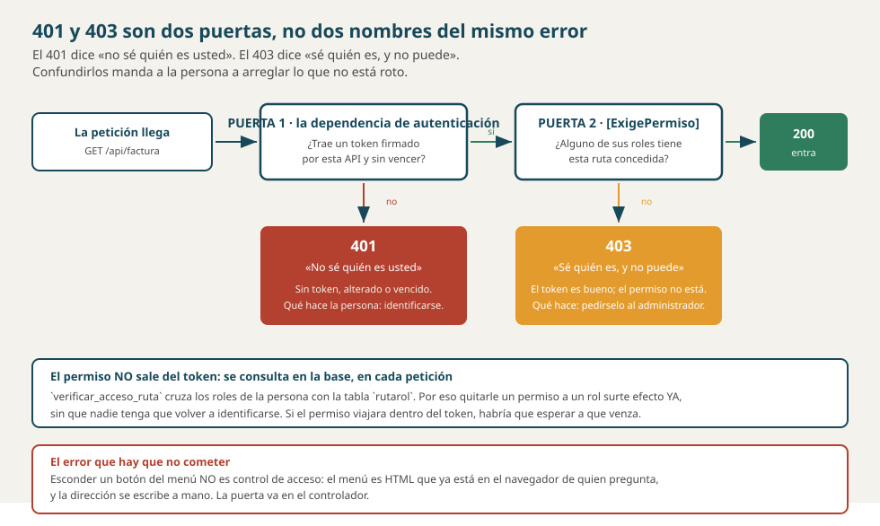

# Versión 3 con IA — índice de las tres guías

> **La versión de la puerta.** Y es la más corta en archivos y la más larga en
> consecuencias: **no agrega ni una tabla ni un recurso**, y cambia los 68
> endpoints que ya existían.

---

## 1. Quién hace qué, y con qué herramienta

> **En este repositorio no hay reparto, y conviene decirlo.** Los otros
> repositorios de la ruta simulan un equipo de tres —Carlos, Paco y Luis— con
> una guía por estudiante. Aquí el ejemplo lo construye **una sola persona**
> ([`CRONOGRAMA.md`](../../../dominio/CRONOGRAMA.md)), así que esta guía es la
> única: cubre la versión entera.

> **Es la última versión con chat para Paco y Luis.** Desde la v4 los tres pasan
> a agente — **`PLAN_DE_TRABAJO.md`** §3.

---

## 2. Quién escribe cada documento de ESTA carpeta

| Documento | Lo redacta |
|---|---|
| [`2_spec.md`](2_spec.md) · [`4_research.md`](4_research.md) · [`7_quickstart.md`](7_quickstart.md) | **quien construye** |
| [`3_plan.md`](3_plan.md) · [`5_data_model.md`](5_data_model.md) · [`6_contracts.md`](6_contracts.md) · [`8_tasks.md`](8_tasks.md) | **quien construye** |
| [`9_checklist.md`](9_checklist.md) · este índice | **quien construye** |
| `GUIA_IA3_<NOMBRE>` | **cada quien la suya** |

Manda **`PLAN_DE_TRABAJO.md`** §5.

---

## 3. Lo que define esta versión: **no se agrega nada**

| | |
|---|---|
| Tablas nuevas | **ninguna** |
| Recursos nuevos | **ninguno** |
| Endpoints nuevos | **dos** — `POST /api/sesion` y el de permisos |
| Endpoints que cambian | **los 68 que ya había** |

> **Por eso es la versión más fácil de subestimar.** Mirar cuántos endpoints
> suma diría que casi no es trabajo — y es al revés: le pone una puerta a todo lo
> construido hasta ahora. Ver
> [`REQUISITOS_FUNCIONALES.md`](../../../dominio/REQUISITOS_FUNCIONALES.md) §7.

> **Y las tablas del control de acceso ya existen desde la v2.** `usuario`,
> `rol`, `ruta`, `rol_usuario` y `rutarol` están hechas, con su CRUD. Lo que
> llega ahora **no es administrarlas: es hacerlas valer.** Son dos cosas
> distintas, y confundirlas es el error de lectura más común del mapa de
> versiones.

---

## 4. Las dos preguntas, que no son la misma

**Esto lo tienen que entender los tres**, porque es la pregunta de sustentación
garantizada de la versión:

| | La pregunta | Quién la responde | Si falla |
|---|---|---|---|
| **401** | *«¿Quién es usted?»* | `la dependencia de autenticación`, con el token | **401 Unauthorized** |
| **403** | *«Y usted, ¿puede?»* | `el guardia de permisos`, **después** | **403 Forbidden** |

> **Confundirlas manda a la persona a arreglar lo que no está roto.** Un 401 se
> arregla volviendo a entrar; un 403 no — por más veces que entre, sigue sin
> permiso. Decirle «no autorizado» a quien sí está autenticado es mandarlo a
> perder la tarde.



---

## 5. El permiso se consulta EN CADA PETICIÓN

Y no viaja dentro del token. Lo resuelve un procedimiento que ya existe:

```sql
verificar_acceso_ruta(@p_email, @p_fkidruta)
   -- cruza:  usuario → rol_usuario → rutarol
```

> **Qué compra eso, y es una decisión del negocio, no técnica:** quitarle un
> permiso a un rol **surte efecto de inmediato**. Si el permiso viviera en el
> token, habría que esperar a que expire — y el jefe que quita un acceso
> tendría que pedirle a esa persona que vuelva a entrar.
>
> **Qué cuesta:** una consulta a la base de datos por petición. Se paga a sabiendas.

---

## 6. Lo que vale para los tres

### La IA tiene que COMENTAR lo que escribe

> **Y en esta versión con más razón**, porque el código de seguridad es el que
> peor se lee seis meses después. Un `[ExigePermiso("interfaz.facturas")]` sin
> comentario no dice de dónde sale esa cadena ni quién la reparte.

**La interpretabilidad se califica** desde la v2, hablando y en persona.

### Su identidad, antes del primer commit

```powershell
# Parado en LA CARPETA DEL PROYECTO. Y compruébela siempre.
git config user.name "su-usuario-de-github"
git config user.email "su-correo-de-github"
git config user.name ; git config user.email
```

### Nadie trabaja en `main`

`rama-carlos-v3`, `rama-paco-v3`, `rama-luis-v3`. Todo por **Pull Request**.
Solo Carlos fusiona.

---

## 7. El orden

```
   1 · CARLOS              2 · PACO                3 · LUIS            4 · CARLOS
   el token y la puerta →  el hash y el permiso →  el menú por rol →   integra
```

> **Aquí el orden es una cadena, no un reparto.** Paco no puede probar un 403 si
> no hay token que lo identifique; Luis no puede esconder un menú si no sabe qué
> permisos tiene quien entró. **Los tres trabajan en fila**, y es la única
> versión donde pasa.

---

## 8. Cuándo está terminada

| Qué se comprueba | Cómo |
|---|---|
| La contraseña está cifrada | `SELECT contrasena FROM usuario` → hashes, no texto |
| **Ninguna respuesta la devuelve** | `GET /api/usuario` no la trae |
| Sin token: **401** | Cualquier endpoint sin cabecera |
| Con token y sin permiso: **403** | Entre como `cliente1@correo.com` y pida `/api/factura` |
| El login no delata | «correo que no existe» y «clave mala» dan **la misma** respuesta |
| El permiso surte efecto ya | Quite un permiso: funciona **sin volver a entrar** |
| El menú se adapta | Entre con los tres usuarios y compare |
| **La regresión** | Las 68 operaciones de v1 y v2 — **ahora con token** |

> **La regresión de esta versión es especial:** todo lo que antes funcionaba
> **ahora exige un token**. Si algo sigue respondiendo sin él, ahí quedó un
> agujero.

```powershell
git tag -a v3 -m "Version 3: el control de acceso"
git push origin v3
```
